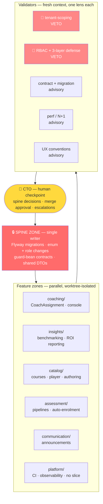
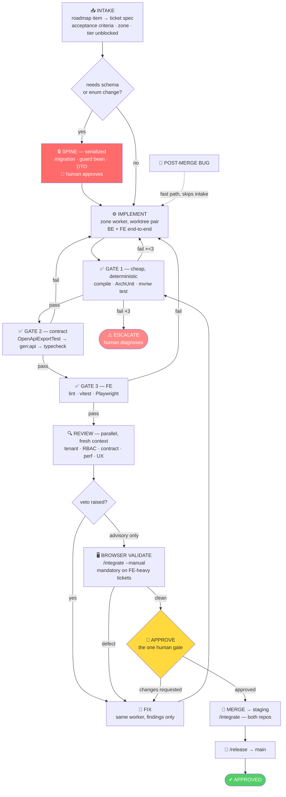
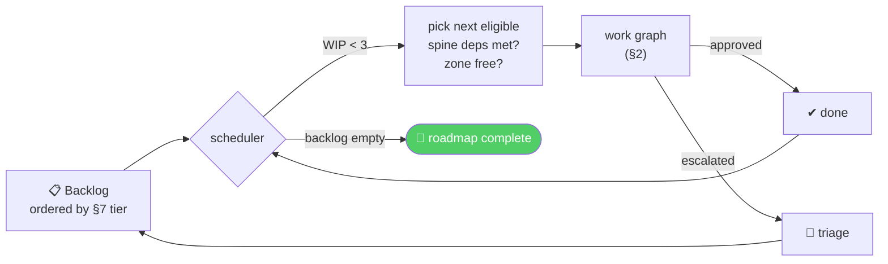

# Agent Execution Graph — delivering the roadmap

Design date: 2026-07-25
Companion to `docs/production-roadmap-board-review.md` (what to build, in what order)
This document: **how to execute it** — implementation, review, fix, merge, approval.

---

## 0. The design principle

Graph engineering — wiring specialised agents into nodes with routed edges and
shared state — is the layer above single-agent loops. The concept is not new
(Airflow has been a task graph for a decade; Anthropic's 2024 *Building
Effective Agents* named every pattern). What changed is **what lives inside the
nodes**: agents interpret tasks, so they can misread instructions and behave
differently across runs. That makes questions you could previously defer —
state handoff, veto authority, stop conditions, cost budgets — mandatory to
specify upfront.

It also introduces the failure mode that decides this entire design:

> *"A graph of agents checking agents can produce extremely organized
> nonsense."* Agents on the same model reading the same flawed context tend to
> **agree with each other**, amplifying errors instead of catching them. The
> mitigation is that evidence must come from **outside the system** — tests that
> actually ran, builds that actually passed, a human who actually looked.

This is why the graph below is viable here specifically. This codebase has an
unusually strong supply of outside-the-system evidence:

| Deterministic gate | Catches |
|---|---|
| `ArchitectureRulesTest` | Cross-feature imports; module boundary violations |
| `bareIdLoadsOnOrgOwnedReposRequireGuard` | Un-guarded tenant loads, at build time |
| Flyway CI check | Any edit to a committed migration |
| `OpenApiExportTest` → `pnpm gen:api` → `contract-check.ts` | BE/FE contract drift, as a typecheck failure |
| Design-token lint rule | Hardcoded brand hex |
| `StartupSafetyValidator` | Missing secrets, fail-closed |
| `./mvnw test` · `pnpm typecheck` · Playwright | Behaviour |

**Rule: no LLM reviewer is spent on anything a rule can decide.** Reviewers
exist only for the semantic questions no rule can express.

---

## 1. Org graph — stable, answers *who*

Long-lived zones. Each owns a bounded domain with persistent context; no zone
bleeds into another's. ArchUnit already enforces these boundaries, so the zones
are real, not aspirational.

### Node specifications

| Node | Model | Context it receives | Authority | Stop condition |
|---|---|---|---|---|
| **Orchestrator** | Opus 5 | Roadmap §7, ticket queue, zone status, WIP count | Routes, spawns, cancels | — |
| **Spine writer** | Opus 5 | Full schema, migration history, role model | **Exclusive** write on migrations/enums | Human approval per migration |
| **Zone worker** | Sonnet 5 | Ticket spec + its own slice + `CLAUDE.md` + spine output. **Not** other zones. | Implements within its slice | 3 gate failures → escalate |
| **Mechanical worker** | Haiku 4.5 | One file + one rule | Breadth sweeps only (empty states, breadcrumbs, `error.tsx`) | 2 failures → escalate |
| **Validator** | Opus 5 | **Diff + spec only** — never the implementer's reasoning | V1/V2 veto; others advise | One pass, no iteration |
| **Human** | — | Batched: one approval per feature | Final | — |

Two things in that table are load-bearing.

**Validators get the diff and the spec, never the implementer's chain of
thought.** Handing a reviewer the author's reasoning is precisely how you get
agreement instead of review. Fresh context is the anti-groupthink control.

**Worker model is Sonnet, orchestrator and validators are Opus.** The
advisor-orchestrator pattern reports roughly 92% of top-tier quality at ~63% of
cost. Spend capability on routing and judgement, not on typing.

---

## 2. Work graph — dynamic, answers *what, right now*

The per-feature lifecycle. Every roadmap item traverses this; it is the answer
to *implementation → review → bug fix → re-implementation → merge → approved*.

### Why the edges run this way

**Gates before reviewers, cheapest first.** An agent reviewing code that does
not compile is pure waste. Gate 1 is seconds, Gate 2 is minutes, review costs
real tokens. Order by cost.

**Fix routes to Gate 1, not to Implement.** A fix is a small diff against
working code; re-running the full implementation loses context and risks
regression on parts that already passed.

**Review runs parallel, converges at a veto decision.** Five lenses at once,
one merge point. Tenant-scoping and RBAC hold veto because they are security;
the rest advise, and their findings ride along to the human gate rather than
blocking.

**Exactly one human gate per feature.** With a solo CTO the human checkpoint is
the scarcest node in the graph. Interrupting per-stage converts the bottleneck
into a stall. Everything batches to one approve-to-merge decision, plus the
spine approvals, which are unavoidable.

**Post-merge bugs skip intake.** Spec already exists; re-deriving it is
ceremony.

---

## 3. Outer loop — until the whole roadmap is approved

### Scheduling rules

1. **Tier order wins.** Phase 1 (Growth-tier revenue) before Phase 2, per §7.
   The graph does not get to reorder the business case.
2. **WIP cap of 3.** Not a throughput choice — a structural one. Migrations
   serialize through the spine and merges serialize through `/integrate`, so a
   higher WIP builds a queue at both ends and increases merge conflicts without
   finishing anything sooner.
3. **One active ticket per zone.** Two agents in `coaching/` conflict; two
   agents in `coaching/` and `insights/` provably cannot.
4. **Spine tickets never run concurrently.** Ever. See §4.
5. **Escalations pre-empt.** A blocked ticket held open consumes a zone.

---

## 4. Project-specific constraints that shape this graph

These are not generic multi-agent advice. They come from this repository, and
ignoring any of them breaks the design.

### Flyway numbering is a mutex

Migrations are immutable and append-only, and CI rejects edits to committed
ones. Two agents allocating `V145` concurrently produce a conflict that cannot
be rebased away — one migration must be rewritten along with everything that
assumed it. **All schema work serializes through the spine zone, single writer,
human-approved.** This is the hardest constraint in the design and the reason
the spine node exists at all.

### The frozen-violations store is a trap

An agent that hits an `ArchitectureRulesTest` failure will find
`src/test/resources/architecture/frozen-violations/` and "fix" the build by
adding its violation there. The build goes green, a design error becomes
permanent debt, and nothing reports it.

> **Every worker prompt must carry:** *never write to
> `frozen-violations/`. An ArchUnit failure means redesign the dependency or
> escalate.*

### Worktrees come in pairs

Two git repos. Isolation means a backend worktree **and** a web worktree per
agent, on matching branch names. The contract pipeline crosses between them, so
an agent holding only one is broken in a way it will not detect until typecheck
— in the repo it does not have.

### The contract pipeline is a hard edge, not a convention

`entity → migration → DTO → OpenApiExportTest → target/openapi.json →
pnpm gen:api → contract-check.ts → typecheck`. Four steps across two repos, and
skipping it surfaces the failure in the *other* repository. It is Gate 2, and
it is not optional on any ticket touching a DTO.

### Verification is asymmetric — deliberately compensate

Backend: 100 test files, ArchUnit, contract pins. Strong.
Frontend: 12 test files against 600 source files. "Tests pass" is close to
meaningless.

So the graph weights differently by side: **deterministic gates carry the
backend; browser validation carries the frontend.** `/integrate --manual` is
mandatory on FE-heavy tickets, not a nice-to-have. Until FE coverage rises,
that human-observed run *is* the outside-the-system evidence.

### The human checkpoint is one person

Design for scarcity: batch approvals, one gate per feature, escalate with a
diagnosis rather than a question. An escalation that reads *"Gate 1 failed 3×
on ArchUnit `bareIdLoads`; the service loads by ID outside a guard; two options,
recommend A"* costs a minute. One that reads *"it's failing, what should I do?"*
costs an hour.

---

## 5. What stays out of the graph

Laziness applies to orchestration too. Graphs cost design overhead, expand the
failure surface, and force you to declare every node, edge and failure mode
upfront. Do not pay that where a loop suffices.

| Work | Why not a graph |
|---|---|
| **§9 spine decisions** | Yours. A graph will choose a plausible role model and you will live with it for years. |
| **Auto-enrolment engine** | One coherent design, high blast radius — it writes enrollments for real users. Its hard parts are idempotency, override and audit, exactly the properties that break when several agents each hold a partial model. Single agent, sequential, your review. |
| **Anything touching pricing tiers** | Money path. |
| **One-file bug fixes** | A loop is enough. Intake ceremony costs more than the fix. |
| **Exploratory work** | Graphs need declared nodes and edges. If the shape isn't known, one agent should go find out first. |

The durable skill is not naming the architecture — it is deciding which parts
deserve a probabilistic agent and which stay boring, deterministic code.

---

## 6. Where the payoff actually is

Against §7's ~43.5 engineer-weeks of ~45 available, this graph exists to buy
back weeks. It will not do that on deep design work — coach console
architecture, auto-enrolment — where the bottleneck is judgement, not typing.

It pays on **wide, shallow, independently verifiable** work:

| Sweep | Scale | Why it fits |
|---|---|---|
| UX P0 — breadcrumbs, empty states, next-lesson CTA | 39 pages | Mechanical worker, per-file, one rule |
| `@PreAuthorize` audit | 65 controllers | Read-only fan-out, one lens |
| FE test backfill from 2% | ~600 files | Zone-parallel, gate-verified |
| Route `error.tsx` / `loading.tsx` | `/app` tree | Pure template application |
| Orphan/soft-FK detection | Whole schema | Analysis fan-out |

Two-line summary of the whole design: **fan out on the boring, keep one loop on
the interesting, and never let an agent be the last thing that says it works.**

---

## Sources

- [Louis Bouchard — Graph Engineering Explained: What Actually Changed](https://www.louisbouchard.ai/graph-engineering-explained/)
- [explainX — Graph Engineering: Wire Multi-Agent Orgs After Loops (2026)](https://explainx.ai/blog/graph-engineering-ai-agents-multi-agent-organizations-2026)
- [Eigent — Graph Engineering for AI Agents](https://www.eigent.ai/blog/graph-engineering-ai-agents)
- [AI Builder Club — Graph Engineering Guide 2026](https://www.aibuilderclub.com/blog/graph-engineering-guide-2026)
- [Strands Agents — Graph Multi-Agent Pattern](https://strandsagents.com/docs/user-guide/concepts/multi-agent/graph/)
- [Augment Code — Multi-Agent Orchestration: A Practical Architecture](https://www.augmentcode.com/guides/multi-agent-orchestration-architecture-guide)
- [Sourcegraph — Context Engineering: A Practical Guide for AI Agents](https://sourcegraph.com/blog/context-engineering)
