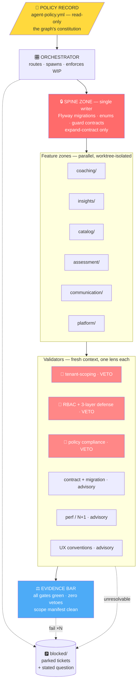
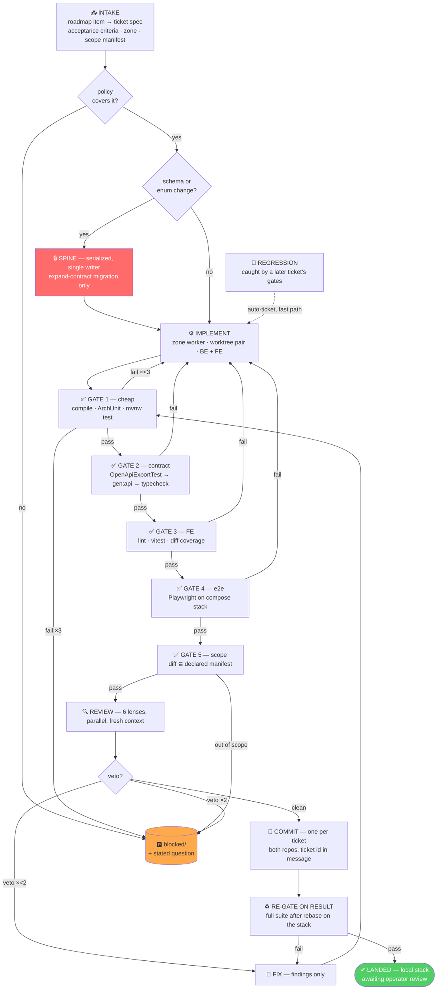
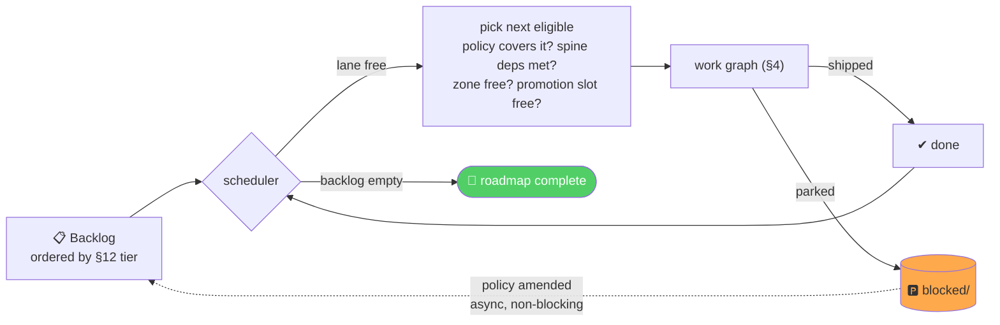

# Agent Execution Graph — autonomous roadmap delivery

Design date: 2026-07-25
Companion to `docs/roadmap.md` (what to build, in what order) and
`docs/agent-policy.yml` (the machine-readable decisions agents load)
This document: **how to execute it autonomously** — implementation, review, fix,
landing — with no human in the loop.

**Resuming a run?** Read `docs/agent-run-report.md` first — it carries live state
(what landed, what is verified, what runs next) and a resume protocol that needs
no conversation history. This document is design; that one is status.

---

## 0. The design principle

Graph engineering — wiring specialised agents into nodes with routed edges and
shared state — is the layer above single-agent loops. The concept is not new
(Airflow has been a task graph for a decade; Anthropic's 2024 *Building
Effective Agents* named every pattern). What changed is **what lives inside the
nodes**: agents interpret tasks, so they can misread instructions and behave
differently across runs. That makes questions you could previously defer —
state handoff, veto authority, stop conditions, cost budgets — mandatory to
specify upfront.

It also introduces the failure mode that decides this entire design:

> *"A graph of agents checking agents can produce extremely organized
> nonsense."* Agents on the same model reading the same flawed context tend to
> **agree with each other**, amplifying errors instead of catching them. The
> mitigation is that evidence must come from **outside the system** — tests that
> actually ran, builds that actually passed, error rates that actually moved.

In a human-gated graph, the human is a cheap source of outside evidence. **This
graph has no human in the loop, so every gram of authority must come from
machine-checkable evidence.** That is achievable here — this codebase has an
unusually strong supply of it:

| Deterministic gate | Catches |
|---|---|
| `ArchitectureRulesTest` | Cross-feature imports; module boundary violations |
| `bareIdLoadsOnOrgOwnedReposRequireGuard` | Un-guarded tenant loads, at build time |
| Flyway CI check | Any edit to a committed migration |
| `OpenApiExportTest` → `pnpm gen:api` → `contract-check.ts` | BE/FE contract drift, as a typecheck failure |
| Design-token lint rule | Hardcoded brand hex |
| `StartupSafetyValidator` | Missing secrets, fail-closed |
| `./mvnw test` · `pnpm typecheck` · Playwright | Behaviour |

**Rule: no LLM reviewer is spent on anything a rule can decide.** Reviewers
exist only for semantic questions no rule can express — and under autonomy they
advise or veto, they never approve.

---

## 1. Autonomy prerequisites — build these first

Removing the human removes three specific functions. Two of the three
replacements do not exist yet. **The graph must not run autonomously until they
do**, because without them there is no signal that a bad change shipped.

| Human function removed | Autonomous replacement | Status |
|---|---|---|
| Spine judgement (role model, schema shape) | **Policy record** — decisions pre-committed as an artifact the graph reads (§2) | ✅ Exists — roadmap §14 |
| Browser validation on FE tickets | **e2e green locally** against the sandbox stack | ❌ Specs exist, never run. Ticket `e2e_local_green`. |
| "Something looks wrong in production" | **Error tracking** as the regression signal | ❌ No exception aggregation on either end. Ticket `error_tracking`. |
| Judging whether a diff is in scope | **Scope manifest** — declared file globs per ticket | ❌ Ticket `scope_manifest_gate`. |
| Deciding merge readiness | **Evidence bar** — all gates green, zero vetoes, scope clean | ✅ Composable from the above |

**These are the run's own first tickets, not a separate human phase.** The
autonomous run builds its own evidence layer before it builds features — every
Phase 1 ticket declares `depends_on` them, so the scheduler enforces it without
supervision. Error tracking becomes the regression signal; local e2e becomes the
frontend's only real evidence, since at ~2% coverage a green build says almost
nothing about the surface most tickets touch.

> Under `run_mode.git: LOCAL_COMMITS_ONLY` nothing leaves the machine anyway, so
> the blast radius while these are being built is the sandbox plus a local
> commit stack — both fully revertable.

---

## 2. The policy record — judgement moved *before* the loop

You cannot automate the decision "should `COACH` be a separate role from
`INSTRUCTOR`." You *can* decide it once and hand the graph a constitution.

**This is the core move that makes human-free operation coherent: judgement is
not deleted, it is relocated from runtime interrupt to declared artifact.**

The policy record is a committed file the orchestrator and every worker read as
authoritative. Its initial contents are the eight decisions already closed in
roadmap §14:

```yaml
# docs/agent-policy.yml — excerpt (the real file is committed alongside this one)
roles:
  coach_separate_from_instructor: true      # §14.1
  manager: DELETE                            # §14.2 — migrate holders to MEMBER
calendar: INTEGRATE_CAL_COM                  # §14.3 — do not build native booking
i18n: { scope: UI_CHROME_ONLY, before: 2027-Q3 }   # §14.4
white_label: { logo: true, colors: true, custom_domain: false }  # §14.5
communications: ANNOUNCEMENTS_ONLY           # §14.6
vertical: ACCELERATOR_FIRST                  # §14.7 — never add SCORM/xAPI/HRIS
tier_order: [GROWTH, FOUNDER_SUCCESS, PERSONALIZATION]  # §7

hard_constraints:
  - never_write: "src/test/resources/architecture/frozen-violations/**"
  - migrations: EXPAND_CONTRACT_ONLY         # §11 — additive, reversible by code revert
  - never_touch: ["**/pricing/**", "**/founder-content.ts"]
  - one_feature_per_promotion: true
```

**A ticket hitting a question the policy does not answer decides, logs, and
continues** (`on_ambiguity: DECIDE_AND_LOG`). The entry lands in
`agent-decisions.md` — ambiguity, options, choice, reasoning, and honestly how
expensive it is to reverse — so the operator reviews what they were not asked
about.

**Except for `never_auto_decide`**, which always parks: irreversible schema
contraction, user-data deletion, auth-model changes, anything under
`never_touch`, and any attempt to revisit a closed decision. Those are the
choices where being wrong is not cheaply undoable, so they wait rather than
guess.

The `defaults` block exists to make both paths rare — it pre-answers the design
questions the backlog is known to raise.

---

## 3. Org graph — stable, answers *who*

Long-lived zones. Each owns a bounded domain with persistent context; no zone
bleeds into another's. ArchUnit already enforces these boundaries, so the zones
are real, not aspirational.



### Node specifications

**Every node runs Opus 5.** Effort tier varies, model does not.

| Node | Model · effort  | Context it receives | Authority | Stop condition |
|---|-----------------|---|---|---|
| **Orchestrator** | Opus 5 · high   | Policy record, roadmap §12, ticket queue, zone status, WIP | Routes, spawns, cancels, parks | — |
| **Spine writer** | Opus 5 · max    | Full schema, migration history, policy record | **Exclusive** write on migrations/enums | Expand-contract check fails → park |
| **Zone worker** | Opus 5 · high   | Ticket spec + scope manifest + its own slice + `CLAUDE.md` + spine output. **Not** other zones. | Implements within its declared scope | 3 gate failures → park |
| **Mechanical worker** | Opus 5 · medium | One file + one rule | Breadth sweeps only | 2 failures → park |
| **Validator** | Opus 5 · max    | **Diff + spec + policy only** — never the implementer's reasoning | V1–V3 **absolute veto, no override**; rest advise | One pass, no iteration |

### Why single-model, and what it costs

The advisor-orchestrator pattern (capable orchestrator, cheaper workers) reports
roughly 92% of top-tier quality at ~63% of cost. We decline that trade
deliberately: the failure modes here are tenant-scoping and RBAC correctness on
multi-tenant founder assessment data, where a missed guard is a cross-org data
leak rather than a bug — and with no human reviewing, a downgraded worker's
mistake has one fewer chance to be caught. Consistent with `CLAUDE.md`, cost is
controlled by **effort tier and gate ordering, not model downgrade**.

That choice has a consequence the graph must actively compensate for.

**Homogeneity raises groupthink risk, so context controls carry it alone.**
Mixed models gave a little reviewer diversity for free — different priors,
different mistakes. An all-Opus graph gives that up, making the §0 failure mode
*more* live. Under autonomy the compensating controls are not optional:

- **Validators receive diff + spec + policy, never the implementer's chain of
  thought.** Handing a reviewer the author's reasoning is how you get agreement
  instead of review.
- **One lens per validator**, assigned explicitly. Five Opus reviewers told to
  "review this" return five versions of the same opinion.
- **Vetoes are absolute and cannot be overridden.** With no human arbiter,
  there is nobody to overrule a security finding, so the graph does not get a
  mechanism to try. Repeated veto → park.
- **Deterministic gates remain the primary evidence.** Uniformly strong
  reviewers are still reviewers. ArchUnit does not have an opinion.

**Effort tiers do the cost work.** `low` on mechanical per-file sweeps, `high`
on implementation and routing, `max` on the spine and validators — the two
places where being wrong is expensive and hard to reverse.

---

## 4. Work graph — the autonomous per-feature lifecycle



### Why the edges run this way

**Gates before reviewers, cheapest first.** Reviewing code that does not compile
is pure waste. Gate 1 is seconds, Gate 5 is a glob check, review costs real
tokens. Order by cost.

**Gate 5 (scope) is new and exists only because the human left.** A human
reviewer notices a diff that wandered into `pricing/` or rewrote an unrelated
service. Nothing else does. The ticket declares its file globs at intake; a diff
outside them parks the ticket rather than merging it. This is the cheapest
control in the graph and it catches the widest class of autonomous drift.

**Fix routes to Gate 1, not Implement.** A fix is a small diff against working
code; re-running implementation loses context and risks regressing what already
passed.

**Re-gate on the merged result, not the branch.** Two features that each pass
independently can break together — this is the one place a barrier is genuinely
required, and skipping it is how autonomous merge queues ship broken staging.

**One commit per ticket.** Deliberately not batched: the operator reviews a
stack on return, and a stack where each commit is one ticket with green gates is
reviewable. A stack of mixed commits is not, and nothing can attribute a
regression to a cause.

**Landing is local.** Under `LOCAL_COMMITS_ONLY` there is no push, no staging
merge and no soak — §5 covers what substitutes.

**Regressions surface through later tickets' gates**, not through production
error signal, and auto-ticket onto the fast path.

---

## 5. Landing work — mechanics

Not using the interactive `/integrate` and `/release` skills; both assume an
operator. Under `run_mode.git: LOCAL_COMMITS_ONLY` the run also does not push,
open PRs, or merge to staging. Work accumulates as a reviewable local commit
stack.

### Per-ticket

1. Worker claims a **worktree pair *and* a lane**, together, as one unit.
   - *Worktree pair* — `backend/` and `web/` on matching branch names. Two
     repos; an agent holding one is broken in a way it cannot detect.
   - *Lane* — `sandbox.sh up <n>`, then source `agent-<n>.env`. A lane is its
     own Postgres, Redis, MinIO and Mailpit. **A worktree without a lane is
     precisely the collision:** two agents on isolated branches still sharing
     one database, where agent A's migration makes agent B's Flyway validation
     fail on a migration B never wrote — and the failure attributes to B.
   - Lanes 1..N are for agents. **Lane 0 belongs to the operator**; never take
     it. Never `:5432` — that is dev.
2. All five gates green locally (`agent-policy.yml → gates`). **This is the
   evidence** — the same commands CI would run, minus the push latency.
3. **One commit per ticket**, message carrying the ticket id, in both repos.
   Never commit per action.
4. Red after 3 attempts → park with the failing gate output attached, release
   the zone, move to the next eligible ticket.

### What replaces the staging soak

The full design promotes through a staging soak on error-rate and job-liveness.
That needs a deployed environment and a push, so under local-only it does not
apply. The substitutes:

- **The lane is the blast-radius container.** Every migration and every write
  lands in that agent's disposable stack, and `sandbox.sh reset <n>` restores it
  without touching any neighbour. Dev is not reachable — it is not even running.
- **e2e against the agent's own lane is the behavioural evidence**, standing in
  for post-deploy error signal. At ~2% frontend coverage it is the only
  meaningful check on most UI work — which is why `e2e_local_green` is a Phase 0
  gate. It must target `E2E_BASE_URL` from the lane env: pointed anywhere else
  it tests some other process and reports green, which is §0's failure mode
  arriving through the one gate meant to prevent it.
- **The operator is the promotion gate**, asynchronously, reviewing the commit
  stack on return rather than approving each ticket in-flight.

When the run is later allowed to push, restore the soak: it is the only node
that decides on evidence from a *running system* rather than from the build, and
nothing local reproduces that.

### Why rollback is asymmetric here — and the rule that fixes it

**Flyway migrations are append-only and immutable. Code can be reverted; an
applied migration cannot.** An autonomous pipeline that ships a destructive
migration has no undo, and no human watching to catch it before it applies.

This makes one rule mandatory rather than advisable:

> **Expand-contract only.** Migrations may add columns, tables and nullable
> fields. They may never drop, rename, or narrow a type in the same release as
> the code that depends on the change. Contraction happens in a later,
> separately-shipped migration once the expanded form has soaked.

Under that discipline a code revert is *always* sufficient, because the schema
after any single migration still satisfies the previous code. The spine writer
enforces it; a migration failing the expand-contract check parks rather than
merges. This is the single most important safety property in the autonomous
design.

---

## 6. Outer loop — until the whole roadmap ships



### Scheduling rules

1. **Tier order wins.** Phase 1 (Growth-tier revenue) before Phase 2, per §7.
   The graph does not reorder the business case.
2. **WIP cap = `agent-policy.yml → max_parallel_agents`** (authoritative; the
   script's `LANE_MAX` is a capacity ceiling, not policy). The binding
   constraint is **lane count** — one isolated stack per concurrent agent, and
   an agent without a free lane has nowhere safe to run. Under
   `LOCAL_COMMITS_ONLY` there are no promotions to serialize, so that is no
   longer the reason.
3. **One active ticket per zone** — declared as `zone:` on every backlog entry,
   and enforced regardless of how many lanes are free. Two agents in `coaching/`
   conflict; agents in `coaching/` and `insights/` provably cannot.

   A lane isolates the **runtime**. It does not isolate **files**: two agents in
   two worktrees can still both edit `pom.xml` or `package.json`, and under
   `LOCAL_COMMITS_ONLY` there is no merge step to expose it — the conflict lands
   on the operator, not the run. Zone exclusivity is what prevents that, so it
   binds even when lanes are idle.
4. **Spine tickets never run concurrently.** Ever — see §7.
5. **One promotion in flight.** A ticket soaking blocks the next promotion, not
   the next implementation.
6. **Parked tickets release their zone immediately.** The blocked queue is read
   asynchronously; it never stalls the loop.

**Expect idle lanes early.** Four of Phase 0's five tickets are zone `platform`
and share build files, so Phase 0 runs roughly two-wide (`platform` chain plus
`auth`). Phase 1 is two-wide (`coaching` spine plus `webapp`). Real fan-out
begins at Phase 2, once independent slices exist and the sweeps unlock. That
profile is the design working, not a scheduling failure to optimise away.

---

## 7. Project constraints that shape this graph

Not generic multi-agent advice — these come from this repository, and ignoring
any of them breaks the design.

### Flyway numbering is a mutex

Migrations are immutable and append-only, and CI rejects edits to committed
ones. Two agents allocating `V145` concurrently produce a conflict that cannot
be rebased away — one migration must be rewritten along with everything that
assumed it. **All schema work serializes through the spine, single writer.**
Combined with expand-contract (§5), this is the hardest constraint in the
design and the reason the spine node exists.

### The frozen-violations store is a trap

An agent hitting an `ArchitectureRulesTest` failure will find
`src/test/resources/architecture/frozen-violations/` and "fix" the build by
adding its violation there. The build goes green, a design error becomes
permanent debt, and — with no human reviewing the diff — nothing ever reports
it. Under autonomy this is not a papercut, it is silent architectural decay.

> Carried in the policy record as a hard constraint, enforced at Gate 5, and
> repeated in every worker prompt: *never write to `frozen-violations/`. An
> ArchUnit failure means redesign the dependency or park the ticket.*

### The contract pipeline is a hard edge

`entity → migration → DTO → OpenApiExportTest → target/openapi.json →
pnpm gen:api → contract-check.ts → typecheck`. Four steps across two repos;
skipping it surfaces the failure in the *other* repository. Gate 2, mandatory on
any ticket touching a DTO.

### Verification is asymmetric — compensate structurally

Backend: 100 test files, ArchUnit, contract pins. Strong.
Frontend: 12 test files against 600 source files. A green build says little.

With a human, browser validation covered the gap. Without one, **e2e against the
sandbox stack is the frontend's only evidence** — which is why `e2e_local_green`
is a §1 prerequisite rather than a nice-to-have. Any FE-heavy ticket attempted
before it is green is running unverified, so the scheduler gates them on it.

---

## 8. What stays out of the graph

Laziness applies to orchestration too. Graphs cost design overhead, expand the
failure surface, and force you to declare every node, edge and failure mode
upfront. Do not pay that where a loop suffices.

| Work | Why not |
|---|---|
| **Policy amendments** | The one thing a human still does — asynchronously, by editing a file. Judgement moved before the loop, not into it. |
| **Auto-enrolment engine** | One coherent design, high blast radius — it writes enrollments for real users. Idempotency, override and audit break when several agents each hold a partial model. Single agent, sequential. |
| **Pricing / tier code** | Money path. Named in the policy record as never-touch. |
| **Contraction migrations** | Drops and renames are irreversible under an autonomous pipeline. Human-authored, always. |
| **One-file bug fixes** | A loop is enough; intake ceremony costs more than the fix. |
| **Exploratory work** | Graphs need declared nodes and edges. Unknown shape → one agent goes and finds out first. |

The durable skill is not naming the architecture — it is deciding which parts
deserve a probabilistic agent and which stay boring, deterministic code.

---

## 9. Where the payoff actually is

This graph exists to raise throughput and confidence at once. It adds least on
deep design work — coach console architecture, auto-enrolment — where the
constraint is judgement and blast radius, not how much can be written in
parallel. Fanning those out buys nothing and costs coherence.

It pays on **wide, shallow, independently verifiable** work:

| Sweep | Scale | Why it fits |
|---|---|---|
| UX P0 — breadcrumbs, empty states, next-lesson CTA | 39 pages | Mechanical worker, per-file, one rule |
| `@PreAuthorize` audit | 65 controllers | Read-only fan-out, one lens |
| FE test backfill from 2% | ~600 files | Zone-parallel, gate-verified — also feeds the §1 prerequisite |
| Route `error.tsx` / `loading.tsx` | `/app` tree | Pure template application |
| Orphan / soft-FK detection | Whole schema | Analysis fan-out, no writes |

Two-line summary: **fan out on the boring, keep one loop on the interesting, and
— since no human says it works — make sure something that is not an agent does.**
