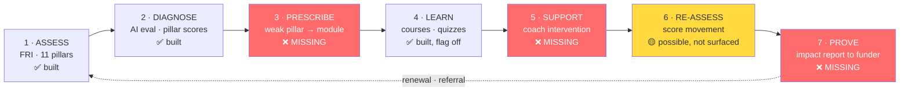
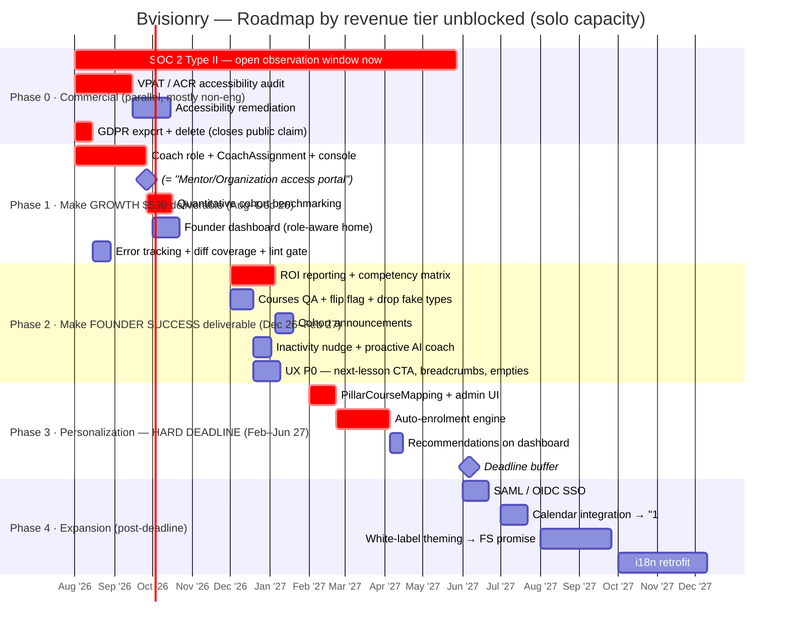
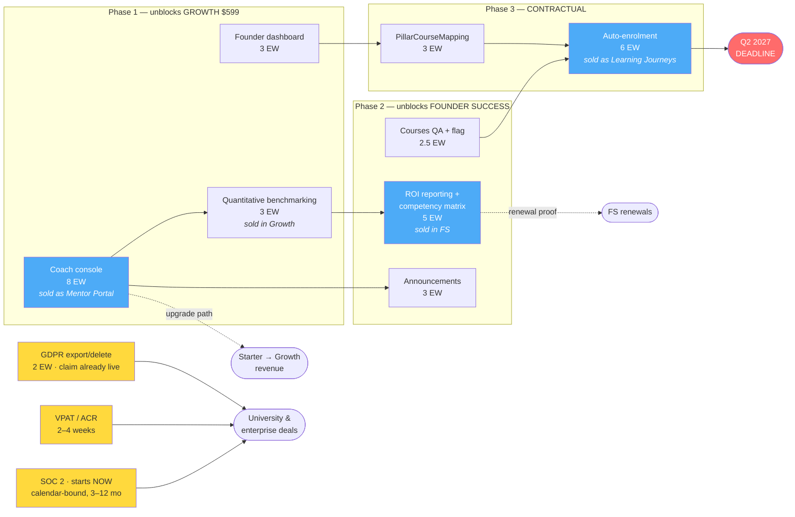

# Bvisionry — Board Roadmap & Strategic Review

Review date: 2026-07-25
Reviews: `docs/production-roadmap-requirements.md` (2026-07-21)
Audience: board + exec. Engineering detail stays in the source doc.

---

## 0. Verdict in one page

The engineering audit is **accurate**. I re-verified its load-bearing claims
against `main` as of today and every one held (§1). It is an unusually honest
internal assessment — no vanity, correct gap identification, sensible sequencing.

It has **two blind spots**, and both are the kind that a board needs to hear
about rather than an engineer:

1. **No go-to-market lens.** The doc plans features. It does not plan for the
   things that decide whether a university, accelerator, or corporate buyer is
   *allowed* to sign: SOC 2 Type II, an accessibility conformance report
   (VPAT/ACR), enterprise SSO (SAML/OIDC), and SCORM/xAPI content portability.
   In 2026 these are hard procurement gates, not differentiators. They are also
   **calendar-bound, not effort-bound** — you cannot compress a SOC 2 Type II
   observation window by working harder. Not starting them is the single most
   expensive decision available right now.

2. **No capacity model.** The plan is scoped as if a team exists. Git history
   over the last six months shows **one contributor** across 790 backend and
   600 frontend source files. At that capacity the three phases as written are
   roughly **17 months of work against an 11-month deadline** (§4). The plan
   does not fail on quality — it fails on arithmetic.

There is also a **product/roadmap mismatch** worth more than either. The
document plans an LMS. The pricing page sells the **Founder Readiness Index —
an assessment instrument priced per cohort**, in which learning content appears
only in the top tier. That is not a positioning debate to be had; the
positioning is already chosen and it is the right one. The problem is that the
engineering backlog and the price list describe different products, and
**several features that are sold today do not exist** (§5.2). The roadmap
should be ordered by which priced tier each item unblocks.

**Headline recommendation:** re-order the plan around the tier ladder, cut the
first phase by half, start compliance immediately in parallel (it costs
calendar, not code), and put the Q2 2027 personalization deadline on the
critical path from today rather than after a six-month Phase 1.

---

## 1. Verification — is the audit telling the truth?

I checked the claims the rest of the plan rests on. All confirmed.

| Claim in the audit | Verified finding | Verdict |
|---|---|---|
| `MANAGER` role is dead | 2 references in 790 files — the enum declaration and one comment. Zero authorities. | ✅ Confirmed |
| `INSTRUCTOR` is authoring-only, not a coach | 18 references, all catalog/quiz authoring | ✅ Confirmed |
| Self-paced courses complete but flagged off | `src/lib/features.ts` — `courses: NEXT_PUBLIC_COURSES_ENABLED === "true"`, default off, admin authoring deliberately ungated | ✅ Confirmed |
| Zero i18n both ends | No `next-intl` / `i18n` / `lingui` in `package.json`; no locale on user or org | ✅ Confirmed |
| Test coverage is thin | BE 100 test files / 790 source (12.7%), JaCoCo floor 0.10. **FE 12 test files / 600 source (2%)** | ✅ Confirmed — FE worse than stated |
| Missing sitemap/robots/manifest | None present; `sw.js` exists | ✅ Confirmed |
| `Breadcrumb` primitive barely used | 4 files reference it | ✅ Confirmed |
| Exotic lesson types may not render | `SCORM`, `WEBPAGE`, `ARTICLE` exist in the `ContentType` enum and the API contract with **no runtime anywhere** | ✅ Confirmed — see §6, this is a decision not a deletion |

Two things the audit did not surface, both material:

- **Enterprise SSO does not exist.** Auth is Google OAuth2 + local credentials.
  There is no SAML 2.0 or OIDC IdP integration. Universities and corporates
  require it in the security questionnaire.
- **Team capacity is one person.** 105 backend and 84 frontend commits in six
  months from a single human (two git identities) plus AI assistance. High
  velocity for one — but every estimate in the plan must be read through it.

---

## 2. Where the product actually stands

```mermaid
flowchart TB
    subgraph BUILT["✅ Built & production-grade"]
        direction LR
        B1["Assessment engine<br/>11 pillars · AI eval · scoring"]
        B2["Course catalog<br/>player · progress · resume"]
        B3["Certificates<br/>PDF · public verify"]
        B4["Cohorts · Orgs · Sub-orgs<br/>multi-tenant scoping"]
        B5["Workshops<br/>live delivery"]
        B6["Notifications<br/>email · web push · prefs"]
        B7["AI coach<br/>SSE streaming"]
    end

    subgraph PARTIAL["🟡 Half-built — value trapped"]
        direction LR
        P1["Founder dashboard<br/>data exists, no aggregate"]
        P2["Pillar → course link<br/>forward only, no reverse"]
        P3["Cohort analytics<br/>assessments only, not learning"]
        P4["White-label<br/>data-scoped, not branded"]
        P5["Self-paced library<br/>DONE but flag = off"]
    end

    subgraph MISSING["❌ Absent"]
        direction LR
        M1["Coach persona<br/>no role, no console, no model"]
        M2["Auto-enrolment<br/>⏰ Q2 2027 deadline"]
        M3["Human comms<br/>no messaging at all"]
        M4["i18n"]
        M5["Booking / calendar"]
    end

    subgraph BLIND["🚨 Not in the plan — procurement gates"]
        direction LR
        X1["SOC 2 Type II"]
        X2["VPAT / ACR · WCAG 2.1 AA"]
        X3["SAML / OIDC SSO"]
        X4["SCORM / xAPI portability"]
        X5["Outcome & impact reporting"]
    end

    BUILT --> PARTIAL --> MISSING --> BLIND
```

The shape of this picture is the good news: **the hard, slow, risky parts are
done.** A working AI evaluation pipeline, a multi-tenant model with sub-org
hierarchy, and a complete course player are each many months of work that no
longer need doing. What remains is mostly composition, wiring, and commercial
readiness — cheaper per unit of value than what has already been paid for.

The bad news is that the trapped value in the middle band is significant and
compounding. A finished course library behind a disabled flag earns nothing.

---

## 3. The product loop — and where it breaks

The reason personalization carries a hard deadline becomes obvious when the
product is drawn as a loop rather than a feature list.

Steps 1, 2 and 4 — the expensive ones — are built. The loop is broken at 3, 5
and 7, which are comparatively cheap. **Three medium-sized pieces of work
convert a collection of features into a defensible product.** That is the
entire strategic argument for the roadmap below, and it is why I would spend
the next two quarters on 3, 5 and 7 rather than on i18n, white-label or a
booking system.

Step 7 deserves particular attention because it is absent from the source doc
entirely. Accelerators, universities and government-funded programs must report
outcomes to LPs, funders and grant bodies. That report is what gets their
budget renewed. A platform that generates it becomes the system of record and
is nearly impossible to displace at renewal.

---

## 4. Feasibility — the arithmetic problem

### Capacity

Estimates below are **engineer-weeks (EW)** at the current observed solo
velocity with AI assistance. I assume ~45 productive EW available in the
11 months to the Q2 2027 deadline, discounting for support, ops, sales
engineering and everything else a CTO does that is not committing code.

| Phase as written in the source doc | My estimate | Doc's implied size |
|---|---|---|
| Phase 1 — launch core + coach view | **26 EW** | "a phase" |
| Phase 2 — personalization | **24 EW** | "a phase" |
| Phase 3 — scale | **25 EW** | "a phase" |
| **Total** | **≈75 EW ≈ 17 months solo** | — |
| **Available before deadline** | **≈45 EW ≈ 11 months** | — |
| **Gap** | **≈30 EW — about 6 months short** | — |

The plan is not wrong. It is **1.7× oversubscribed**. Left unaddressed, the
predictable failure mode is that Phase 1 absorbs everything, personalization
starts around Q1 2027, and the one item with a hard external commitment ships
late or ships thin.

### Where the doc's individual estimates are off

| Item | Doc | My estimate | Why |
|---|---|---|---|
| White-label theming | M–L | **L (8 EW)** | Runtime tenant theming across 600 FE files, plus branded email sender, plus custom domain routing. Consistently underestimated in every product I have seen do it. |
| Auto-enrolment engine | L | **L (6 EW)** — correct | Sizing is right. The overrun risk is idempotency, admin override and audit, not the rules engine. |
| Coach console | L | **L (8 EW)** — correct | Correctly sized, and correctly identified as the unlock for three other items. |
| i18n retrofit | L | **L (10 EW)** | Right call, right reasoning. The "adopt next-intl for new surfaces now" advice is the correct cheap hedge — take it. |
| Discussion threads + DMs | M+M | **8 EW** | Plus ongoing moderation load, which is operational cost, not build cost, and never appears in estimates. |
| Courses QA + flag flip | S | **2 EW** | Twelve lesson types across desktop and mobile is not a small QA pass. |

### One estimate I would change on principle

The doc proposes ratcheting the JaCoCo coverage floor 10% → 40%. Chasing a
global percentage across 790 files is weeks of work that produces tests nobody
asked for over code nobody is changing. **Require coverage on changed lines
instead** (diff coverage, ~70% on new code). It is one CI configuration change,
it makes every future PR safer, and it costs a fraction of the ratchet. The
frontend at 2% is the genuine risk and should get the attention the backend
ratchet would have consumed.

---

## 5. What we sell — and what we owe

### 5.1 The product is the FRI, priced per cohort

The pricing page settles what the engineering doc leaves ambiguous. Bvisionry
does not sell an LMS or seats. It sells the **Founder Readiness Index**, priced
by **cohort and founder capacity**:

| Tier | Monthly | Annual eff. | Capacity | Learning content? |
|---|---|---|---|---|
| **Starter** | $299 | $209 | 1 cohort/quarter · 20 founders | ❌ None |
| **Growth** *("most clients start here")* | $599 | $419 | 1 cohort/month · 40 founders | ❌ None |
| **Founder Success** | Contact Sales | — | Unlimited | ✅ Journeys + coaching |

Annual billing discounts ≈30%. The feature comparison ladder reads
`Assessment & Screening → Development & Learning → Analytics & Reporting`, and
the accelerator vertical page runs `Screen → Diagnose → Develop` against the
stated pain: *"you invest heavily in founder development but lack data to prove
transformation or justify program ROI to donors."* Four verticals are
addressed — accelerators, universities, investors, corporate.

Two consequences the roadmap has not absorbed:

**Learning is a top-tier add-on, not the product.** Two of the three tiers ship
zero content. The LMS is delivery machinery for Founder Success contracts.

**The unit of value is a measured cohort.** Every roadmap item should be scored
by whether it lets us sell a cohort, upgrade a cohort, or renew a cohort.

### 5.2 The delivery gap — sold today, not built today

This is the finding that should reorder the plan. The following appear on the
live pricing page as included features:

| Sold in | Promised feature | Reality | Cost to close |
|---|---|---|---|
| **Growth $599** | "Mentor/Organization access portal" | ❌ **Does not exist.** This is the coach console. The **only** unbuilt feature in the self-serve ladder — it is what a Starter customer pays to upgrade for. | 8 EW |
| **Growth $599** | "Cohort benchmarking" | 🟡 Partial — `TeamInsightResult.Benchmarking` produces an AI-narrated *team vs platform* section with outlier pillars in the org insight PDF/Excel. Demos well. Not a quantitative cross-cohort corpus. | 3 EW to make it statistical |
| **Founder Success** | "ROI reporting & analytics" | ❌ Does not exist. The renewal driver for the highest-ACV tier. | 5 EW |
| **Founder Success** | "Personalized learning journeys" | ❌ The Q2 2027 auto-enrolment item. | 10 EW |
| **Founder Success** | "Group + 1:1 coaching sessions" | ❌ No booking or calendar model. | 3 EW (integrate) |
| **Founder Success** | "White-label platform option" | 🟡 Data-scoping only; no branding, no theming, no sender identity. | 8 EW |
| **Founder Success** | "Custom FRI analysis" | 🟡 Deliverable as a service today. | — |
| — | Course library | ✅ Built, flag off. **Not sold in Starter or Growth**, so it blocks no self-serve revenue — only Founder Success delivery. | 2.5 EW QA |

Read as a backlog this is unremarkable. Read as a **price list** it is urgent:
Growth is the featured tier, and one of its two differentiating features does
not exist while the other is thinner than the label implies.

**What can be sold safely today**, until the phases in §7 land:

- **Starter** — fully deliverable now.
- **Growth** — deliverable *except* the mentor/organization portal. Until
  Phase 1 ships, either scope it out of the contract or commit to a date.
- **Founder Success** — Contact Sales, so delivery can be staged per contract.
  Do not sign one that requires white-label or native booking before Q3 2027,
  and do not commit personalized journeys earlier than Q2 2027.

One housekeeping item: `fri-pricing-plans.tsx` documents an
`fri-enterprise` tier living in an "Enterprise & Add-Ons" section. Neither the
tier nor the section exists. Stale comment, but it implies a fourth tier
somebody once intended to sell.

### 5.3 Market validation of the model

The pricing is well placed. Accelerator-management platforms sit at roughly
**$200–800/month per program**, putting Growth at $599 squarely in band — and
those competitors (**AcceleratorApp**, at 500+ programs and ~40% of major US
accelerators; **F6S**; **Babele**, used by Google, the UN and Bosch;
**Catalyzer**; **Sopact Sense**) sell *program operations*: applications, deal
flow, mentor matching, demo days, portfolio tracking. Bvisionry sells the
diagnostic instead. Same buyer, same budget line, different product — which is
a better place to be than competing on ops feature count.

The category's identified structural weakness is what Sopact calls the
**"Cohort Cliff"**: no persistent founder identity connecting intake data to
program activity to outcome data in one queryable record, described as an
architectural gap that cannot be closed by adding a feature. Bvisionry has that
record already — per-pillar scores, AI evaluation, maturity thresholds,
repeatable over time, scoped to a founder inside an org and cohort. Benchmarking
and ROI reporting (§5.2) are the two features that *expose* it. They are sold
and unbuilt, and they are the moat.

**Selling the instrument rather than the LMS also lowers the procurement bar.**
LMS buyers gate on SCORM, xAPI and HRIS — a content-portability roadmap we do
not want and, given the tier ladder, do not need. `SCORM`, `WEBPAGE` and
`ARTICLE` exist in the `ContentType` enum with no runtime behind them; remove
them from the authoring UI rather than implement them. Instrument buyers gate on
something else entirely, and that bar has not been budgeted for:

| Requirement | Status | Consequence of absence |
|---|---|---|
| **SOC 2 Type II** | ❌ Not started | The most common late-stage B2B deal blocker; minimum standard above ~100 employees, and explicitly required by university CIO/CISO vendor-risk programs. Needs a **3–12 month observation window** that cannot be compressed. |
| **VPAT / ACR (WCAG 2.1 AA)** | ❌ Not started | Described as *virtually impossible to sell to multiple universities without one* in 2026. Requested at three separate procurement gates. **2–4 weeks to obtain.** |
| **SAML 2.0 / OIDC SSO** | ❌ Google OAuth only | Near-universal enterprise and university requirement; confirmed with IT during procurement. |
| **GDPR export & deletion** | ⚠️ **Claimed publicly, not built** | The pricing FAQ states assessment data is *"encrypted and GDPR-compliant."* Retention jobs exist; account export and deletion do not. A public compliance claim ahead of the control surfaces in exactly the review where it costs most. |
| **Validity evidence for the FRI** | ❌ None | Assessment instruments are bought on validity — Gallup and Hogan sell decades of validation studies. Nothing currently captures whether a pillar score predicts funding, survival or revenue. |
| ~~SCORM / xAPI / HRIS~~ | N/A | Drops out of scope under this positioning. Revisit only if corporate L&D becomes a primary vertical. |

The last row is the one nobody has written down. It is a data-capture and
research item, not an engineering one, and it is the difference between "our AI
scores your pillars" and "founders below 40 on Pillar 6 fail to raise at 3× the
rate." One is a feature; the other is a company.

### 5.4 Where the market is going

- **Adaptive personalization is now the defining capability** — real-time
  adjustment of path and pacing from learner performance, with reported effects
  of ~30% lower time-to-competency and 40–50% higher completion. The Q2 2027
  auto-selection item is both a contractual obligation and the thing the
  category is judged on.
- **Skills taxonomy and competency mapping is the organising primitive**;
  platforms map content to competencies and visualise mastery matrices. The 11
  pillars *are* a competency framework that is not yet exposed as one.
- **Proactive AI agents** that monitor progress and intervene are shipping in
  CYPHER and Degreed. The AI coach here is reactive chat on infrastructure that
  already supports more.
- **Outcome and impact proof** is the accelerator-specific expression of the
  same trend, is sold in Founder Success, and remains unclaimed ground.

These are not differentiators. Their absence loses deals silently, usually
late, after the effort of the sales cycle has been spent.

| Requirement | Status | Consequence of absence |
|---|---|---|
| **SOC 2 Type II** | ❌ Not started | The single most common late-stage B2B deal blocker. Minimum standard for buyers over ~100 employees; university CIO/CISO vendor-risk programs require it explicitly. |
| **VPAT / ACR (WCAG 2.1 AA)** | ❌ Not started | Described as *virtually impossible to sell to multiple universities without one* in 2026. Requested at three separate procurement gates. |
| **SAML 2.0 / OIDC SSO** | ❌ Google OAuth only | Near-universal enterprise priority. Buyers confirm the protocol with IT during procurement. |
| **SCORM / xAPI** | ⚠️ Enum only, no runtime | Forcing a buyer to convert an existing content library is called out as a procurement red flag. |
| **HRIS integration** | ❌ | Expected for corporate buyers; less relevant for accelerators. Defer. |
| **Mobile access** | ✅ | Baseline expectation, already met. |
| **Analytics & reporting** | 🟡 | Assessment-side only; learning-side missing. |
| **AI-assisted authoring** | 🟡 | Now considered table stakes rather than a differentiator. AI infrastructure exists; it is not pointed at authoring. |
| **GDPR / EAA** | 🟡 | The European Accessibility Act has applied to EU-accessible SaaS since June 2025. Multi-language ambition implies EU users, which implies both. |
| **FERPA** | ❌ | Only if US student data is handled. Scope decision. |

The timing asymmetry matters more than the list. An ACR takes **2–4 weeks**.
SOC 2 Type II requires a **3–12 month observation window** before a report
exists. Starting SOC 2 in Q1 2027 means no report until late 2027 — with no way
to buy the time back. **This is why compliance belongs in Phase 0, starting
now, in parallel with everything else.** It consumes calendar and money far
more than it consumes engineering weeks.

### 5.3 Where the market is going

- **Adaptive personalization is now the defining LMS capability** — real-time
  adjustment of path, difficulty and pacing from learner performance. Reported
  effects: time-to-competency down ~30%, completion rates up 40–50%. The Q2
  2027 auto-selection item is not merely a contractual obligation; it is the
  feature the category is being judged on.
- **Skills taxonomy and competency mapping is the organising primitive.**
  Platforms map content to competencies and visualise mastery matrices. The
  11-pillar model is already a competency framework — it simply is not exposed
  as one.
- **AI agents that monitor progress and intervene proactively** are shipping in
  CYPHER and Degreed. The AI coach here is reactive chat; the infrastructure to
  make it proactive already exists.
- **Outcome and impact proof** is the accelerator-specific expression of the
  same trend, and the highest-leverage unclaimed ground.

---

## 6. What I would add, change, or kill

### Add — highest leverage first

1. **Founder Readiness Report / impact reporting for program operators.**
   Cohort-level pillar movement over time, per-founder deltas, exportable and
   brandable for funders and LPs. Certificate PDF generation and export
   infrastructure both already exist, so most of the plumbing is paid for.
   *~4 EW. This is the renewal driver and the clearest differentiator on the
   board.*
2. **Expose the 11 pillars as a formal competency framework** — mastery matrix
   per founder, per cohort, with movement over time. Almost entirely a
   presentation layer over data that already exists, and it converts an
   assessment into a skills product that matches how the market now buys.
   *~2 EW.*
3. **Proactive AI coach nudges.** Point the existing AI infrastructure at
   detected inactivity and score drops instead of waiting to be asked. Merges
   naturally with the doc's inactivity-reminder item and turns a table-stakes
   chatbot into the category-standard proactive agent. *~2 EW on top of the
   reminder work.*
4. **SAML/OIDC SSO** — a procurement gate, and cheap relative to what it
   unblocks. *~3 EW.*
5. **Benchmarking.** "Your cohort vs. the Bvisionry average for pre-seed B2B
   SaaS." Only possible with a cross-tenant scoring corpus, which accumulates
   with every assessment run. It is the one feature that gets more valuable as
   customers are added and cannot be copied by a new entrant. *~3 EW, and it
   should be started once data volume supports it.*

### Change

6. **SCORM is a decision, not a deletion.** The doc suggests removing
   unimplemented lesson types. Correct for `WEBPAGE` and `ARTICLE` — they are
   currently a lie in the authoring UI and should go this week. But SCORM/xAPI
   *import* is how corporate and university buyers bring their existing
   libraries, and its absence is a documented procurement red flag. Remove it
   from the UI now; put xAPI import on the roadmap **if** enterprise sales are
   in the plan. That is a commercial decision, not an engineering one.
7. **Cohort analytics should be re-scoped as impact reporting** (item 1) rather
   than a completion-rate chart. Same data, materially different value, similar
   cost.

### Kill or defer past the deadline

8. **Native booking system** — the doc's own recommendation to integrate
   Cal.com or Calendly first is right. Do not build availability, slots, ics
   and reminders. *Saves ~7 EW.*
9. **Founder↔founder DMs and full discussion threads** — announcements plus the
   existing exercise comment loop cover the majority of the need at a fraction
   of the cost, and neither carries a moderation burden. *Saves ~5 EW.*
10. **Full i18n retrofit** — defer execution past the deadline, but take the
    doc's hedge now: adopt `next-intl` for new surfaces only, so the bill stops
    growing. *Defers ~10 EW.*
11. **Command palette, org/sub-org tree unification, bottom tab bar** — real
    improvements, none of them blocking a deal or a deadline. *Defers ~6 EW.*

---

## 7. Recommended roadmap — ordered by the tier it unblocks

Each phase is defined by the revenue it releases, not by its engineering theme.
The ordering rule: **deliver what is already sold, cheapest tier first, before
building anything that is not yet sold.**

| Phase | Unblocks | Commercial effect |
|---|---|---|
| **0 · Commercial** | All tiers | Removes procurement blockers; closes a live GDPR claim |
| **1 · Growth tier** | $599/mo self-serve | Makes the featured tier fully deliverable; enables Starter→Growth upgrade |
| **2 · Founder Success** | Contact Sales ACV | ROI proof — the renewal driver — plus content delivery |
| **3 · Personalization** | Founder Success | Contractual Q2 2027 obligation |
| **4 · Expansion** | New segments | SSO, booking, white-label, i18n |

### What changed from the source doc's ordering, and why

**The coach console moves from Phase 1 item 3 to the very first thing built.**
The source doc justifies it architecturally — it unlocks the review queue,
messaging and calendar. The stronger reason is commercial: it is sold as the
"Mentor/Organization access portal" in Growth, it is the only unbuilt feature in
the self-serve ladder, and it is therefore the single feature standing between
a $299 customer and a $599 one. Nothing else on the list has a clearer payback.

**The courses flag drops from first to Phase 2.** I had it first in my previous
draft, and the pricing page shows that was wrong — courses are not sold in
Starter or Growth at all, so flipping the flag releases no self-serve revenue.
It is a Founder Success delivery dependency, so it lands alongside the rest of
that tier's work.

**Benchmarking is promoted into Phase 1.** It is a paid Growth feature that
currently ships as an AI-written narrative. Making it quantitative both honours
the label and starts accumulating the cross-tenant corpus that compounds.

**ROI reporting is promoted into Phase 2 and framed as the renewal driver.** The
source doc has it as mid-priority "cohort completion analytics." It is sold, it
is unbuilt, and it is what a program shows its funders to keep its budget.

**GDPR export/delete moves into Phase 0.** Not because of the deadline, but
because the pricing FAQ already claims compliance.

**Phase 3 starts in February with roughly six weeks of buffer.** Under the
source doc's ordering it would begin around Q1 2027 with none.

### Critical path

Three nodes gate everything: the **coach console** (Growth revenue), **ROI
reporting** (Founder Success renewals) and the **auto-enrolment engine** (the
contractual deadline). Compliance runs on a wholly separate track, unaffected by
engineering progress — which is exactly why it starts now.

### Scope fit

| Path | Scope | Capacity | Q2 2027 | Sold-but-unbuilt remaining |
|---|---|---|---|---|
| **A — Solo (recommended baseline)** | Phases 0–3 | ~43.5 EW vs ~45 available | ✅ ~6 weeks buffer | White-label + native booking (both Founder Success, both stageable per contract) |
| **B — Solo, source doc ordering** | Source Phases 1–3 | ~75 EW vs ~45 | ❌ Missed by ~6 months | Growth tier still undeliverable into 2027 |
| **C — +2 engineers from Q4 2026** | Phases 0–3 **plus** SSO, white-label, comms | ~70 EW across 3 | ✅ Met | None — full price list deliverable |

Path A is achievable as things stand and makes every self-serve tier honest by
the end of 2026. Path C additionally clears the Founder Success promises we
cannot currently keep, and is the natural shape of a funding ask.

**Board framing:** Path A is *"we stop selling things we cannot ship, in that
order."* Path C is *"we can also sell the top tier without caveats a year
earlier."*

---

## 8. Risks for the board

| # | Risk | Severity | Mitigation |
|---|---|---|---|
| 1 | **Bus factor of one.** A single person holds 1,390 source files with 2% frontend test coverage. Illness or departure halts the company. | 🔴 Critical | Highest-priority hire. In the interim: diff-coverage CI, architecture decision records, documented runbooks. This is the top item on the list and it is not a feature. |
| 2 | **Compliance not started.** SOC 2 Type II cannot be compressed; every month of delay is a month of blocked enterprise pipeline. | 🔴 Critical | Engage an auditor this quarter. Order the VPAT/ACR in parallel — 2–4 weeks. |
| 3 | **Q2 2027 deadline oversubscribed 1.7×** under the current plan. | 🔴 High | Adopt the Path A cut list (§6) or fund Path C. |
| 4 | **Finished revenue-generating features sitting behind a flag.** | 🟠 High | Two weeks of QA. First item in Phase 1. |
| 5 | **Frontend test coverage at 2%** across 600 files, no e2e in CI, non-blocking lint. | 🟠 High | Diff coverage on changed lines; wire the existing Playwright specs into CI. |
| 6 | **Dead `MANAGER` role** grants nothing while appearing assignable — a user granted it silently gets member access. | 🟠 Medium | Remove in the coach-role migration. Security smell, cheap fix. |
| 7 | **No error aggregation** (Sentry or equivalent) on either end. Production failures are currently invisible. | 🟠 Medium | Half a day of work. Do it this month. |
| 8 | **Category competition is well funded and consolidating** (AcceleratorApp at ~40% of major US accelerators). | 🟡 Medium | Do not compete on program ops. Compete on measurement and outcome proof, where the category has a structural gap. |
| 9 | **24h non-revocable access tokens.** | 🟡 Medium | Shorten to 15–30 min; refresh rotation already works. |
| 10 | **i18n debt compounds with every new page.** | 🟡 Low now | Adopt `next-intl` for new surfaces immediately, even though the retrofit is deferred. |

---

## 9. Decisions I need from you

The source doc asks six open questions. Here are my recommendations, so these
can be closed rather than discussed.

| # | Question | My recommendation |
|---|---|---|
| 1 | `INSTRUCTOR` vs `COACH` | **Two roles.** Authoring and coaching are genuinely different jobs with different data scopes. Keep `INSTRUCTOR` for authoring, add `COACH` scoped by `CoachAssignment`. |
| 2 | `MANAGER` | **Delete.** Migrate existing holders to `MEMBER`. A role that grants nothing while looking meaningful is a security defect, not a placeholder. |
| 3 | Calendar: integrate vs build | **Integrate** (Cal.com). Saves ~7 EW. Revisit only if a customer pays for native booking. |
| 4 | i18n scope | **UI chrome only, and not before Q3 2027.** Translated *content* multiplies the authoring burden for every customer, not just the platform — that is a business model change, not a feature. |
| 5 | White-label depth | **Logo and colours only.** Custom domains and branded email are a long tail of DNS, deliverability and support cost for marginal gain at this stage. |
| 6 | Communications | **Announcements only** for now. Threads and DMs are deferrable; both carry permanent moderation cost. |
| 7 | *(new)* Enterprise or accelerator-first? | **Already decided — accelerator-first**, confirmed by the tier ladder and the four vertical pages. Worth stating explicitly so it is not drifted away from: enterprise L&D would imply SCORM, xAPI and HRIS, a roadmap that should never be entered by accident. |
| 8 | *(new)* Fund Path C? | **Yes if capital allows.** Two engineers from Q4 2026 converts a survival year into a market-position year. If not, Path A is genuinely achievable — but risk #1 remains unaddressed. |

---

## 10. The next 30 days

Ordered. Items 1–3 are calendar-bound and should not wait on the others.

1. Engage a SOC 2 auditor and open the observation window.
2. Order the VPAT/ACR accessibility audit (2–4 weeks to report).
3. Post the engineering hire (risk #1).
4. **Start the coach console** — the Growth-tier "Mentor/Organization access
   portal" we already charge $599/mo for. First code written.
5. Ship GDPR export/delete; the pricing FAQ already claims it.
6. Give sales the deliverable-today list (§5.2) so no further contract commits
   white-label, native booking, or personalized journeys ahead of §7.
7. Wire error tracking on both ends — half a day, removes a blind spot.
8. Switch CI to diff coverage; make lint blocking. Remove `WEBPAGE`/`ARTICLE`/
   `SCORM` from the authoring UI.
9. Close the eight decisions in §9.

---

## Sources

- [D2L — Essential LMS Features 2026](https://www.d2l.com/blog/lms-features/)
- [LMSPedia — Corporate LMS Enterprise Buyer's Guide 2026](https://lmspedia.org/what-is-corporate-lms/)
- [Selleo — LMS Integration: Standards, Costs & Compliance](https://selleo.com/blog/lms-integration-explained-standards-costs-compliance)
- [AcceleratorApp — Best Accelerator Management Software 2026](https://www.acceleratorapp.co/en/blogs/category/all/blog/the-best-accelerator-management-software-in-the-united-states-of-america-2026/)
- [Sopact — Accelerator Software: From Application Scoring to Outcome](https://www.sopact.com/use-case/accelerator-software)
- [Catalyzer — Accelerator & Incubator Program Management](https://www.catalyzerapp.com/accelerators)
- [Babele — Accelerator Management Software](https://babele.co/)
- [CYPHER Learning — Top LMS platforms using AI to personalize learning 2026](https://www.cypherlearning.com/blog/business/top-5-lms-platforms-that-use-ai-to-personalize-learning-in-2026)
- [Disprz — How Adaptive Learning Platforms Revolutionize L&D in 2026](https://disprz.ai/blog/adaptive-learning-platform-overview)
- [360Learning — Top AI-Powered Learning Platforms 2026](https://360learning.com/blog/ai-learning-platforms/)
- [SOC2Auditors — SOC 2 Compliance for Startups 2026](https://soc2auditors.org/insights/soc-2-compliance-for-startups/)
- [episki — SOC 2 for EdTech Companies 2026](https://episki.com/now/soc2-for-education)
- [Accessible.org — Colleges and Universities Now Requiring VPATs](https://accessible.org/news/colleges-universities-requiring-vpats/)
- [AudioEye — SaaS Accessibility in Regulated Industries](https://www.audioeye.com/post/saas-accessibility-regulated-industries/)
- [Accessibility.Works — SaaS VPAT/ACR Guide](https://www.accessibility.works/blog/saas-vpat-acr-guide-reporting/)
