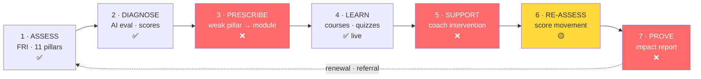
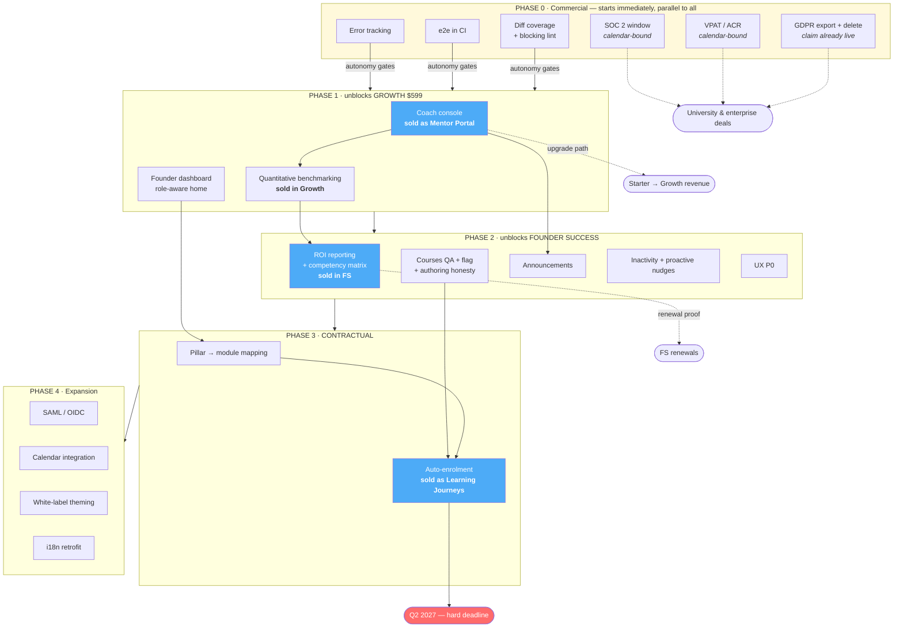

# Bvisionry — Roadmap

What we build, for which tier, in what order, and why. **Not how, and not when.**
Implementation is the delivering agent's call. Sequencing is by dependency and
revenue tier, not by calendar — the only dates here are externally imposed and
listed in §6.

Last revised: 2026-07-25 · Verified against `main`
Scope: `backend` (Spring Boot 4 / Java 21) + `web` (Next.js 16 / React 19)

> **STATUS BANNER — read before Part I.** Parts I and II were written on
> 2026-07-25 and describe the state *before* delivery began. They have not been
> rewritten, so **§3 "the delivery gap", §4 "verified current state" and §5's
> requirements table are deliberately historical** — §3 still lists the coach
> console, ROI reporting, coaching calendar and white-label as unbuilt, and §4
> still says there is no enterprise SSO. All of those shipped.
>
> **For current state, read §7's status column and §11's checkboxes, which ARE
> reconciled against the tree**, then `agent-decisions.md` (per-ticket detail,
> newest last). `agent-run-report.md` is STALE — it stops at wave 8 / 44 tickets
> while the log closed at wave 11 / 55 and then declared the run closed; read it
> for doctrine, not for state.
>
> **Reconciled 2026-08-01 against a green tree** (backend 1274/0/0 · web lint 0 /
> typecheck 0 / 1063 unit · e2e **157 passed ×2 consecutive**):
>
> - **§7** is delivered except item 13 (multi-language, deliberately suspended —
>   `next-intl` is installed nowhere) and item 8 (superseded by #16). Item 11 was
>   downgraded to 🟡: the courses flag never flipped, so the capability is built
>   and dark.
> - **§10** UI/UX P0/P1/P2 is delivered (waves 10–11). The bottom tab bar was
>   declined with reasoning — §10 says "consider", and `MobileSheetNav` already
>   reaches every member destination in two taps.
> - **§11** now stands at **17 of 26 done**. What remains splits cleanly: five
>   items are external engagements no commit can close (SOC 2, VPAT, pen-test,
>   Bing submission, the CDN AI-crawler check), one needs human legal sign-off,
>   and three are real engineering — component tests for the big admin consoles,
>   e2e in CI (blocked on an authored seed, see the item), and actually RUNNING
>   the load test whose harness now exists.
>
> **Update 2026-08-07: `agent/integration` IS pushed** — backend `773f512` and
> web `be88924` verified equal to `origin/agent/integration` on the server
> (`git ls-remote`). The earlier "never pushed" claim was true on 2026-08-01 and
> went stale. **What has still not happened is the merge:** both branches remain
> ~82/~68 commits ahead of `main`, so every ✅ here means "code exists on a
> pushed integration branch", not "in production".
>
> **Update 2026-08-08 (orchestrated run, reconciled against a green tree —
> backend `bdc21b1` 1331/0/0 · web `eee9d8a` lint 0 / typecheck 0 / 1387 unit ·
> e2e 161 ×2 consecutive against the empty-DB + authored-seed lane · k6
> thresholds green):** the three "real engineering" items above are now closed —
> component tests for the six named consoles, e2e in CI (the authored seed
> exists and is proven to carry the suite), and the load test now has numbers.
> Also closed since 2026-08-01: the dependency bump (OSV 67 → 5), per-org
> storage quota (V160), per-account login backoff, the download-token deletion,
> and the courses flag FLIPPED (operator decision — §7 item 11 is ✅). What
> remains in §11 is exactly the external/operator set: SOC 2 · VPAT · pen-test ·
> Bing · CDN crawler check · legal sign-off · GitHub repo settings · uptime
> checks · provider retention (runbook §6) — plus MFA as its own future ticket,
> and the merge itself. Full narrative: decision log, "ORCHESTRATED RUN
> 2026-08-07/08".

**Companions:** `agent-policy.yml` (closed decisions + hard constraints — what
agents load) · `agent-execution-graph.md` (how the work is executed)

---

- [Part I — Strategy](#part-i--strategy) · what we sell, what's missing
- [Part II — The work](#part-ii--the-work) · outcomes and acceptance criteria
- [Part III — Delivery](#part-iii--delivery) · order, risks, decisions · §16 candidates for later

---

# Part I — Strategy

## 1. Verdict

The platform is **much further along than a feature list implies**. The
assessment engine, course catalog and player, certificates, cohorts, multi-tenant
org hierarchy, workshops and notifications are built and hardened. The expensive,
slow, risky work is done.

Three findings define what to do next.

**1 · We sell a measurement instrument, not an LMS.** The pricing page sells the
**Founder Readiness Index**, priced per *cohort*, with learning content only in
the top tier. That positioning is correct and already chosen — but the
engineering backlog had been written as if we were building an LMS. The two
described different products.

**2 · Six features are sold today and do not exist** (§3). Including the
Growth-tier "Mentor/Organization access portal" — the only unbuilt feature in the
self-serve ladder, and therefore the single thing standing between a $299
customer and a $599 one.

**3 · The original ordering built the wrong things first.** It front-loaded work
that unblocks no revenue, left the contractual Q2 2027 obligation until last with
no buffer, and never started the compliance track — the one kind of work no
amount of execution speed can compress.

Ordering rule for everything below: **deliver what is already sold, cheapest tier
first, before building anything that is not yet sold.**

---

## 2. What we sell

| Tier | Monthly | Annual eff. | Capacity | Learning content? |
|---|---|---|---|---|
| **Starter** | $299 | $209 | 1 cohort/quarter · 20 founders | ❌ None |
| **Growth** *("most clients start here")* | $599 | $419 | 1 cohort/month · 40 founders | ❌ None |
| **Founder Success** | Contact Sales | — | Unlimited | ✅ Journeys + coaching |

Annual billing discounts ≈30%. The comparison ladder reads `Assessment &
Screening → Development & Learning → Analytics & Reporting`. Four verticals:
accelerators, universities, investors, corporate.

Two consequences:

**Learning is a top-tier add-on.** Two of three tiers ship zero content. The LMS
is delivery machinery for Founder Success contracts.

**The unit of value is a measured cohort.** Score every item by whether it lets us
sell, upgrade, or renew a cohort.

---

## 3. The delivery gap — sold, not built

| Sold in | Promised | Reality |
|---|---|---|
| **Growth $599** | "Mentor/Organization access portal" | ❌ The coach console. Only unbuilt feature in the self-serve ladder. |
| **Growth $599** | "Cohort benchmarking" | 🟡 Ships as an AI-written *team vs platform* narrative inside org insight reports. Not a quantitative corpus. |
| **Founder Success** | "ROI reporting & analytics" | ❌ The renewal driver for the highest-ACV tier. |
| **Founder Success** | "Personalized learning journeys" | ❌ The Q2 2027 auto-enrolment obligation. |
| **Founder Success** | "Group + 1:1 coaching sessions" | ❌ No booking model. |
| **Founder Success** | "White-label platform option" | 🟡 Data-scoping only; no branding. |
| **Founder Success** | "Custom FRI analysis" | 🟡 Service-delivered today. |
| — | Course library | ✅ Built, feature-flagged off. **Not sold in Starter or Growth** → releases no self-serve revenue. |

### What can be sold safely today

- **Starter** — fully deliverable.
- **Growth** — deliverable *except* the mentor/organization portal. Scope it out
  of contracts or commit to a date until Phase 1 ships.
- **Founder Success** — Contact Sales, so stage delivery per contract. Do not
  sign one requiring white-label, booking, or personalized journeys before the
  phase that delivers it (§12).

---

## 4. Verified current state

Claims re-checked against `main` on 2026-07-25.

| Finding | |
|---|---|
| `MANAGER` role grants **no authorities** — assignable, declared, silently equivalent to member access | ✅ |
| `INSTRUCTOR` is authoring-only. It is not a coach role, and no model links a coach to the founders they coach | ✅ |
| Self-paced courses are **complete but feature-flagged off**; admin authoring is deliberately ungated | ✅ |
| **Zero i18n** on either end — no locale on user or org, all copy hardcoded English | ✅ |
| Test coverage is thin: backend ~13%, **frontend ~2%** | ✅ worse than previously stated |
| No sitemap, robots or manifest; a service worker already exists | ✅ |
| Breadcrumbs are effectively unused across the app | ✅ |
| Three lesson types are offered in authoring with **no player runtime behind them** | ✅ |
| **No enterprise SSO** — Google OAuth + local credentials only. No SAML/OIDC. | new |

Steps 1, 2 and 4 — the expensive ones — are built. The loop breaks at 3, 5 and 7,
which are comparatively cheap. **Three medium pieces convert a feature collection
into a defensible product.**

---

## 5. Market context

Competitors are **program-operations** platforms — AcceleratorApp (500+ programs,
~40% of major US accelerators), F6S, Babele (Google, UN, Bosch), Catalyzer,
Sopact Sense — selling applications, deal flow, mentor matching, demo days. The
band is **$200–800/month per program**, putting Growth at $599 squarely in it. We
sell the diagnostic instead: same buyer, same budget line, different product.

The category's structural weakness is the **"Cohort Cliff"** — no persistent
founder identity connecting intake → activity → outcome in one queryable record,
described as unclosable by adding a feature. **We already have that record.**
Benchmarking and ROI reporting are the features that expose it. Both are sold and
unbuilt (§3). That is the moat.

**Selling the instrument lowers the procurement bar** — SCORM, xAPI and HRIS drop
out of scope entirely. It substitutes a different bar, unbudgeted:

| Requirement | Status | Consequence |
|---|---|---|
| **SOC 2 Type II** | ❌ | Most common late-stage B2B blocker; required by university vendor-risk programs. |
| **VPAT / ACR (WCAG 2.1 AA)** | ❌ | *Virtually impossible to sell to multiple universities without one* in 2026. |
| **SAML 2.0 / OIDC SSO** | ❌ | Confirmed with IT during procurement. |
| **GDPR export & deletion** | ⚠️ **Claimed publicly, not built** | The pricing FAQ states data is *"encrypted and GDPR-compliant."* Retention exists; export/delete do not. |
| **FRI validity evidence** | ❌ | Instruments are bought on validity. Nothing captures whether a pillar score predicts funding, survival or revenue. |
| ~~SCORM / xAPI / HRIS~~ | N/A | Out of scope under this positioning. |

Where the market is going: adaptive personalization is the defining capability
(~30% lower time-to-competency, 40–50% higher completion); skills taxonomy and
competency mapping is the organising primitive — the 11 pillars *are* a
competency framework, not yet exposed as one; proactive AI agents that intervene
are shipping in CYPHER and Degreed.

---

## 6. What is actually calendar-bound

Execution speed is not the constraint on this roadmap. Three things are, and none
of them move faster with more agents:

| Constraint | Duration | Why it can't be compressed |
|---|---|---|
| **SOC 2 Type II observation window** | 3–12 months | An auditor observes controls operating over time. There is no version of this that finishes early. **Not started = enterprise pipeline blocked for its full length.** |
| **VPAT / ACR** | 2–4 weeks | External audit engagement, then remediation. |
| **Q2 2027 personalization obligation** | Fixed date | Contractual. |
| Staging soak per promotion | Per `agent-execution-graph.md` | Error signal needs wall-clock time to appear. |

Everything else is dependency-ordered, not time-ordered. **The compliance track
starts immediately and runs in parallel with all engineering work** — it consumes
budget and calendar, not delivery capacity.

---

# Part II — The work

Each item states the outcome and how we know it's done. **How to build it is the
delivering agent's decision** — investigate the code at execution time rather than
trusting a plan written earlier.

## 7. Backlog

**Blast radius** routes the ticket — it says how much verification the work
needs, not how long it takes:

- **S** — one slice, no schema change, reversible by code revert alone
- **M** — one slice plus schema, or reads across slices; needs the spine
- **L** — new slice or role/enum change; full validator set, highest scrutiny

| # | Item | | Outcome & acceptance criteria | Radius |
|---|---|---|---|---|
| 1 | Authoring honesty | ✅ | Every lesson type offered in authoring renders in the player. Types with no runtime are removed from the authoring UI. | S |
| 2 | Mindset tracking | ✅ | A learner records a reflection against a completed lesson; an admin can see it. Reuse the existing assessment or quiz mechanism if it fits. | S |
| 3 | Founder dashboard | ✅ | A member's home shows assigned modules, completion %, the single next action, and a pillar snapshot — without navigating to separate hubs. All data already exists. | M |
| 4 | **Coach console** *(sold as Mentor Portal)* | ✅ | A coach sees **only** founders on their assigned cohorts; sees completion per founder; can review and comment on submissions; **cannot reach any other cohort's data, enforced server-side**. An org admin can assign coaches to cohorts. Founder detail shows pillar scores + module progress. | L |
| 5 | Reflection prompts | ✅ | Met by quizzes + embedded pillar assessments. Optional: a lighter free-text type where a quiz is too heavy. | S |
| 6 | Certificates | ✅ | Met. | — |
| 7 | Inactivity reminders | ✅ | A founder with no progress on an assigned course for N days is nudged on their preferred channel. N configurable per org. Notification infrastructure exists; only the trigger is missing. | S |
| 8 | Cohort completion analytics | 🟡 | Superseded by #16 — same data, materially more value. | — |
| 9 | Pillar → module mapping | ✅ | An admin declares which modules address which pillar at which score band. A founder viewing results sees recommended modules. | M |
| 10 | **Automated course selection** ⏰ *contractual* | ✅ | On evaluation completion a founder is automatically enrolled in modules matched to their weak pillars, told **why**, and an admin can override. **Re-running an evaluation must not duplicate enrolments.** | L |
| 11 | Self-paced library | ✅ | Full QA across every lesson type on desktop and mobile, then the flag flips. Assigned vs self-selected content is visually distinguishable. **FLIPPED by operator decision 2026-08-07** (web `1d33ed5`): `NEXT_PUBLIC_COURSES_ENABLED` now defaults ON — the predicate is `!== "false"` in both `features.ts` and `e2e/_helpers.ts`, kept identical on purpose — and a deployment withdraws it by setting the var to `false` explicitly. The courses-ON branch has since been exercised by the full e2e suite (161 ×2 green) and its first live run exposed and fixed a real quiz-taking 500 (`bdc21b1`). | S |
| 12 | Mobile / PWA | ✅ | Installable, and the player works on a phone. | S |
| 13 | Multi-language | ❌ | **Deferred.** New surfaces adopt the i18n library now so the retrofit bill stops growing. | L |
| 14 | White-label | ✅ | An org admin sets a logo and palette; the app renders in their brand. **No custom domains, no branded email sender.** | L |
| 15 | Coaching calendar | ✅ | A founder books a session with their assigned coach. **Integrate an existing provider — do not build booking.** | M |
| 16 | **ROI / impact reporting** *(sold)* | ✅ | A program operator produces a report showing pillar movement per cohort over time and per-founder deltas, exportable and presentable to a funder. **This is the renewal driver.** | M |
| 17 | **Competency matrix** *(new)* | ✅ | The 11 pillars render as a mastery matrix per founder and per cohort, with movement over time. Mostly presentation over existing data. | S |
| 18 | **Proactive AI nudges** *(new)* | ✅ | The AI coach initiates contact on detected inactivity or a score drop instead of waiting to be asked. Merges with #7. | S |
| 19 | **Quantitative benchmarking** *(sold)* | ✅ | A cohort's pillar scores are compared against a real cross-tenant distribution, not an AI-written narrative. Compounds with every customer added. | M |
| 20 | Cohort announcements | ✅ | A coach or org admin broadcasts to a cohort; members receive it on their preferred channel with existing opt-out respected. **Announcements only — no threads, no DMs** (policy). | M |

---

## 8. Target role model

Policy, not implementation. Machine-readable in `agent-policy.yml`.

| Role | Persona | Scope | Can do |
|---|---|---|---|
| `SUPER_ADMIN` | Platform team | Platform | Everything |
| `ORG_ADMIN` | Program admin | Own org + sub-orgs | Members, cohorts, authoring, analytics, coach assignment, branding |
| `COACH` **(new)** | Coach / facilitator | **Assigned cohorts/founders only** | Read roster, review submissions, comment, run workshops |
| `INSTRUCTOR` | Content author | Own org | Authoring only — **kept separate from COACH** |
| `MEMBER` | Founder | Self | Own assessments, courses, program, bookings |
| ~~`MANAGER`~~ | — | — | **Delete**; existing holders become `MEMBER` |

Persona and role stay separated — "Founder" is member *type*, not a role. Keep it
that way.

**Non-negotiable:** a coach must be unable to reach data outside their
assignment, enforced server-side, not by hiding navigation.

---

## 9. Communications scope

No human-to-human channel exists today. The closest things are reviewer feedback
on submissions, a workshop "raised hand" flag, and one-way notifications. Support
conversations currently happen off-platform.

**Decision: announcements only.** Contextual threads, coach↔founder DMs and
founder↔founder DMs are deferred — each carries permanent moderation cost for
deferrable value.

Acceptance: broadcast reaches a cohort through existing notification preferences;
bodies are sanitized; coaches moderate within assigned cohorts and org admins
org-wide; every post is reportable and audited; the new type appears in
notification preferences.

---

## 10. UI/UX

Goal: every step reachable in ≤2 obvious clicks from a stable anchor, and the
user is always told what to do next.

**Already good:** consistent page shell and width across the app, clear sidebar
active states, a collapsible icon rail, fully role-gated navigation, correct
deep-linking from the notification bell, a "continue where you left off" card,
and the program task player's exemplary next-step flow.

### Friction

| # | Issue | Impact |
|---|---|---|
| 1 | No breadcrumbs anywhere in the app; admin drill-ins run ~6 levels deep with a single back-hop | Users get lost; no shareable sense of place |
| 2 | **The course player has no "next lesson"** — only "mark complete", then pick from the sidebar | Breaks the core learning loop. The program player already does this right — copy it. |
| 3 | The app home is a link grid, not a dashboard; **admins get no dynamic content at all** | No "needs attention" queue, no next-action guidance |
| 4 | Super-admin sidebar is ~25 flat ungrouped items; org-admin sidebar is 2 links with everything buried a drill-in deeper | Wall-of-links for one role, hidden features for the other |
| 5 | No global search or command palette | Cheapest nav accelerator, given the tree depth |
| 6 | No first-run onboarding; the assessments empty state dead-ends with no CTA | New users land with no path to first value |
| 7 | Assessment results have no onward CTA to modules | Misses the core product loop |
| 8 | Notification inbox is dropdown-only, capped, with no "see all" page | Older notifications unreachable |
| 9 | Post-login lands everyone in the same place regardless of role | Extra hop for admins every session |
| 10 | Parallel org and sub-org admin trees — the same resource has two URLs; nested tabs aren't URL-addressable | Cognitive + maintenance load, unshareable state |
| 11 | An admin route exists that no navigation links to | Dead code |
| 12 | Marketing header has no self-serve signup path | Fine if invite-led; blocks self-serve growth otherwise |

### Requirements

**P0 — core loop & wayfinding**
1. Next-lesson CTA in the course player, with auto-advance option.
2. Breadcrumb trail on every page more than two levels deep.
3. Role-aware home — members get a real dashboard; admins get KPIs and a "needs attention" queue (idle founders, pending reviews).
4. No dead-end empty states — every one names the next action or who to contact.

**P1 — findability & admin ergonomics**
5. Command palette, role-gated.
6. Group the platform sidebar; promote key org-admin destinations out of drill-in-only.
7. Role-based post-login redirect.
8. Full notifications page.
9. Results → recommended module CTA (manual first, automatic once #10 lands).

**P2 — structure & polish**
10. First-run onboarding checklist for members and coaches.
11. Unify the parallel org/sub-org trees — one resource, one URL. Do it alongside the coach console.
12. URL-addressable tabs and filters.
13. Remove the orphan admin route.
14. Mobile: consider a bottom tab bar for member surfaces; audit the horizontal tab scroll on the org console.

### Principles for all new surfaces

- Every page belongs to exactly one sidebar anchor, with a breadcrumb when deeper.
- Every completed action proposes the next one.
- Admin "needs attention" beats admin "browse everything".
- State a user can see should be linkable.
- One resource, one URL.

---

## 11. Cross-cutting production requirements

### Security
- [x] Shorten access-token TTL from 24h to 15–30 min — **15 min** (`0bbd5be`); survivable because `proxy.ts` refreshes before the render
- [x] Audit anonymous read endpoints — done and MECHANISED rather than written down. No lesson body reaches an anonymous caller at all (stronger than the "non-preview" bar this item set): the whole `LessonContentController` is `isAuthenticated()` and gated by enrolment, and the public catalog's lesson projection carries metadata only. Both halves are pinned — `PublicCourseDetailShapeTest` fails if a field is added to the public DTO, `CatalogRouteSecurityIntegrationTest` fails if the `permitAll` matcher is widened from `{slug}` to `**`. Also confirmed: springdoc is disabled in prod, so the `permitAll` on `/v3/api-docs/**` reaches nothing there
- [x] Complete the CSP nonce pipeline — nonce + `strict-dynamic` on `/app/**` (`proxy.ts`). **`style-src` is deliberately NOT nonce-locked**, measured not assumed: component libraries create `<style>` elements from JavaScript at runtime, which can never carry a request nonce, and the nonce-locked version failed the e2e suite in both dev and a production build. Scripts are where a CSP earns its keep; the reasoning is at the directive
- [x] Every new secret gets the same fail-closed startup validation as existing ones
- [ ] Pen-test the public token flows before scale marketing *(external engagement — no code closes this)*
- [ ] **No second factor.** MFA still does not exist anywhere, and enterprise procurement will keep asking for it in the same conversation as SAML; it is its own future ticket (operator decision 2026-08-07). The lockout half landed 2026-08-07 (`c0b00a6`, hardened in `58f8824`) as exactly the deliberately-non-DoS design this item prescribed: per-account exponential backoff keyed on the submitted email (5 free failures, 5s doubling to a 900s cap, decaying counter, **never a hard lock**), recorded atomically in Redis Lua, cleared by successful login and by password reset, with uniform errors and a dummy bcrypt compare on unknown emails so the arm/refuse pair leaks no account existence
- [x] **Dependency bump delivered 2026-08-07** (`cd61b4d`, its own ticket and full gate run as demanded): parent 4.0.5 → 4.0.7 plus `minio` 8.6.0, `jose4j` 0.9.6, `bcprov`/`bcpkix` 1.84 (bcpkix now explicit), `poi-ooxml` 5.4.0, and an explicit `okhttp-jvm` 5.1.0 pin — Maven resolves plain `okhttp` 5.x to a classless Kotlin-Multiplatform root POM. The OSV baseline ratcheted **67 → 5**; all 5 residuals are Spring-Boot-BOM transitives that self-close on the next parent patch, and the ratchet still refuses anything new
- [ ] **GitHub repository settings the operator must enable by hand** — no committed file can do these: Dependency graph (free on private, OFF by default), Dependabot alerts + security updates, and adding the new `Secret scan` job to required status checks. Secret *push protection* is not available — it needs GitHub Secret Protection, sold only on Team/Enterprise, and these are private repos on a personal account; the `secrets` CI job exists precisely to cover that gap
- [x] **Per-org storage quota delivered 2026-08-07** (`6383d6f` + V160, hardened in `58f8824`, NPE-on-default fixed in `bdc21b1`): `organizations.storage_quota_bytes` as a per-org override, NULL meaning the configurable platform default (`bvisionry.minio.org-default-quota-bytes`, 2 GiB); usage measured live from MinIO under `org/<orgId>/` with a short-circuiting scan; enforced at both upload and presign (Content-Length is bound into the presigned signature); refusal is the house 409. The commercial numbers remain the operator's — the mechanism ships, the defaults are theirs to change

### Quality & CI
- [x] Fix the pre-existing lint errors and make lint **blocking** in frontend CI
- [x] **Diff coverage ~70% on changed lines.** Do *not* chase a global coverage percentage — it produces tests over code nobody is changing. The frontend at ~2% is the real risk.
- [x] Component/integration tests for the major app pages — the six named largest all have colocated suites now (2026-08-07: `ai-config-console` 19, `platform-settings` 17, `live-board` 11, `member-actions-dialogs` 43 — which pinned two real silent-privilege-mutation defects, since fixed — `insights-body` 25, `assignments-panel` 27). Web unit suite stands at **1387 tests across 134 files**, all green. The 680–880-line tail is ordinary ongoing work, not a gate; this item's own instruction was "start there rather than at a percentage", and there is done
- [x] **e2e in CI** against a compose stack — **the blocker is gone: the seed is authored and carries the whole suite.** `backend/tools/e2e-seed/e2e-seed.sql` (`181ba8a`, fixed, invented identities, zero real personal data) applies after Flyway migrates the empty CI database, and the workflow's `pull_request` trigger is on. Proven 2026-08-08 on a lane in the exact CI shape — empty DB → Flyway V1..V160 → seed → **161 passed / 1 skipped / 0 failed, ×2 consecutive**, with the courses branch ON. The proving run earned its keep: it surfaced four real defects (quota NPE on the default path, quiz-taking 500, fresh-install AI-console 503, orgadmin seeded into the wrong org — all fixed in `bdc21b1`) plus two hidden data-shape dependencies in specs (web `eee9d8a`). *Two caveats keep this honest: no GitHub runner has ever executed the workflow, and its backend checkout ref pins `agent/integration` — repoint it when the branch merges.*
- [x] Full QA across every lesson type before the courses flag flips

### Observability & operations
- [x] **Error tracking on both ends** — metrics exist, exception aggregation does not. *Autonomy prerequisite: it is the rollback trigger.*
- [x] Alerting on scheduled jobs — `ScheduledJobMonitor` reports every `@Scheduled` job on `/actuator/health/scheduling`, DEGRADED when one has not completed within its own interval ×2 + 1 min. Reads Spring's own `Task.getLastExecutionOutcome()`, so it owns no state and cannot drift. A failed run does not refresh the timestamp — otherwise a job throwing on every tick would report healthy for ever. **Deliberately never DOWN**: `/actuator/health` is a liveness probe, and a late reaper must not get a serving container restarted. Verified live: all 11 jobs discovered, with real intervals and timestamps
- [ ] Uptime + synthetic checks on the public token flows *(external monitoring — no code closes this)*
- [x] Backup/restore drill for Postgres and object storage; documented RPO/RTO — `backend/docs/runbook-backup-restore.md`, and it is **rehearsed, not just written**: `backend/tools/backup/drill.sh` fingerprints a lane, backs up, destroys, restores and verifies, and passes. It also cross-checks every `minio://` marker in the database against the bucket — the one check that catches a database and an object store restored to different points in time. **RPO/RTO are stated as targets with a named gap:** the procedure is proven, the provider retention behind it has never been confirmed by anyone, and §6 of the runbook lists exactly what the operator must verify
- [x] Load-test the anonymous public-assessment path — **executed 2026-08-08** (k6 v2.1.0, lane 1, mock AI profile asserted before any traffic, BFF-shaped client-IP + proxy-secret pair per the harness's own trap note): funnel scenario **580 completions in 85s at 20 VUs, 0 failed requests, submit p95 = 10.02ms** against a 3000ms threshold; abuse scenario from a single IP **98% held by the limiter, 429s only, never a 5xx**. All k6 thresholds passed, exit 0. These numbers are a dev-machine floor under a mocked AI transport, not a capacity ceiling — rerun against production-shaped infrastructure (and the real provider's latency profile) before scale marketing

### Compliance & data
- [x] **GDPR account export + deletion**
- [x] Retention policy surfaced to users — the privacy page's "How long we keep things" section, including the 90-day AI call-log window and the 30-day evaluation cache
- [ ] Terms/privacy review for AI evaluation of user content *(needs human legal sign-off — the product copy is accurate, the review is not an engineering artefact)*
- [ ] SOC 2 Type II observation window opened *(external — the longest pole on this roadmap and still not started)*
- [ ] VPAT / ACR ordered *(external)*

**Correction, and it was load-bearing enough to name.** This item's justification used to be *"the pricing FAQ already claims compliance"*. Export and deletion shipped; **the claim did not change until now**. `FRI_PRICING_FAQS[0]` asserted *"All data is encrypted and GDPR-compliant"* — a compliance STATUS no code can establish, and it was emitted as `FAQPage` structured data that a search engine can surface standalone, detached from any page that qualifies it. It also promised reports "within 24–48 hours" for a flow that finishes in seconds, and mis-spelled a tier's own capacity ("Up to 1 **cohorts**/month"). All three are corrected under an operator-directed amendment to `hard_constraints.never_touch`. The lesson generalises: shipping the feature does not retract the claim, and the claim is what a customer read.

### SEO / PWA / AI discoverability
- [x] Sitemap, robots, manifest — `web/src/app/{sitemap,robots,manifest}.ts`, generated from
      `ROUTES`/`FRI_VERTICALS` so they cannot rot. Token-bearing paths are excluded from both and
      pinned by `sitemap.test.ts` (that is a security property, not an SEO one: `/invitations/{token}`
      accepts a public POST that mints a session).
- [x] JSON-LD identity graph — `lib/structured-data.ts`, Organization + WebSite emitted once on the
      marketing layout so every public URL shares one `@id`.
- [x] `llms.txt` — shipped with honest expectations; see the note below.
- [ ] **Submit the sitemap to Bing Webmaster Tools.** Not optional and not a nice-to-have:
      ChatGPT's live web search is Bing-backed, so Bing indexing is the prerequisite for appearing
      in ChatGPT citations at all. Google Search Console too, but Bing is the one that is usually
      forgotten and the one that gates the largest AI surface.
- [x] Per-page `alternates.canonical` — on all eleven public pages. Still deliberately NOT set globally:
      Next metadata is inherited, so a root canonical would point the whole site at `/`.
- [x] OG images — `src/app/opengraph-image.tsx`, one brand card generated with `next/og` and inherited by
      every route that does not override it. This closed a real defect rather than adding a nicety: the root
      layout has been declaring `twitter.card = "summary_large_image"` with no image behind it, and a large
      card with no image renders worse than declaring no card at all.
- [ ] Verify the CDN does not block AI crawlers while `robots.txt` allows them. Measured research
      found a meaningful share of sites doing exactly this — the two layers disagree silently and
      robots.txt loses.

#### AI search (GEO/AEO) — what the evidence actually supports

Researched 2026-07-29. Ordered by measured impact, not by novelty. The uncomfortable finding is
that most of this is content and distribution work, not engineering — so it is listed here as a
plan, and the engineering half above is already done.

**Tier 1 — technical, done or trivial.** `robots.txt` and `sitemap.xml` are the two universally
respected signals and are now in place. JSON-LD is Google-recommended and the most reliably parsed
structured format. GPTBot crawls roughly 8× more often than Googlebot, so technical changes here
propagate far faster than content changes.

**Tier 2 — content structure, the highest-leverage remaining work.**
- **Q&A formatting raises AI citation rates ~25%; promotional tone lowers them ~26%.** Phrases like
  "the best choice" and "absolutely essential" are actively counterproductive. This has a direct
  implication for the marketing copy: the register that converts a human reader is measurably the
  register that gets skipped by an answer engine.
- **Statistics and cited sources raise citation rates 30–40%** (Princeton, KDD 2024). Concretely:
  publish the FRI methodology with real numbers — pillar count, band thresholds, sample sizes,
  outcome data — and cite them. This is the single biggest lever available and it is a
  content decision, not a code one.
- **BLUF structure.** Answer first, elaborate after. Engines lift scoped answers; they rarely
  summarise a page that buries its claim.
- Add an FAQ block to the high-intent pages and mark it up with `faqLd()` (already written). Only
  where the questions are genuinely visible — `FAQPage` markup for invisible content is a
  spam-policy violation, not a shortcut.

**Tier 3 — authority, the slowest and most durable.**
- AI search is systematically biased toward **earned media over brand-owned content**, and Wikipedia
  alone accounts for ~48% of ChatGPT's top citations. Being written about beats writing about
  yourself.
- E-E-A-T signals: named authors with bios, visible dates, inline references.
- Only ~11% of domains are cited by BOTH ChatGPT and Perplexity, so ranking on one does not transfer.
  Treat them as separate surfaces.

**On `llms.txt`, honestly.** ~10% adoption, and measurement across 500M+ AI bot visits found only
408 requests for it — the answer crawlers ignore it and read HTML. Google stated publicly it does
not support it. It is shipped here because it costs nothing and IDE/coding agents (Cursor, Claude
Code, Copilot) genuinely do read it, and this product's buyers are technical. It is not why anyone
will get cited, and it must not be counted as if it were.

**Context.** AI search handles an estimated 12–18% of English informational queries as of Q1 2026,
up from under 2% a year earlier, and the overlap between top Google results and AI-cited sources has
fallen from ~70% to under 20% — which is the whole argument for treating this as separate work
rather than assuming SEO covers it.

Sources: Princeton KDD 2024 GEO study · 2025 Web Almanac (SEO chapter) · SE Ranking llms.txt
adoption study (300k domains) · Cloudflare AI-crawler reports · llmstxt.org.

---

# Part III — Delivery

## 12. Phase order

Phases are gated by dependency and by the revenue tier they unblock. A phase
starts when its predecessors' acceptance criteria are met — not on a date.

| Phase | Unblocks | Effect |
|---|---|---|
| **0 · Commercial** | All tiers | Removes procurement blockers, closes a live GDPR claim, and enables autonomous delivery. **Runs in parallel with everything — it consumes calendar, not capacity.** |
| **1 · Growth tier** | $599/mo self-serve | Makes the featured tier deliverable; enables the Starter→Growth upgrade |
| **2 · Founder Success** | Contact Sales ACV | ROI proof — the renewal driver — plus content delivery |
| **3 · Personalization** | Founder Success | The contractual obligation |
| **4 · Expansion** | New segments | SSO, booking, white-label, i18n |

### Why this order

**Phase 0 starts immediately** because it is the only work where delay cannot be
recovered by working faster, and because three of its items are the gates that
let the delivery graph run unsupervised at all.

**The coach console is the first feature built.** Not for architectural reasons —
it is sold as the Growth "Mentor/Organization access portal", it is the only
unbuilt feature in the self-serve ladder, and it is therefore the single feature
between a $299 customer and a $599 one.

**The courses flag drops to Phase 2.** Courses are not sold in Starter or Growth,
so flipping the flag releases no self-serve revenue. It is a Founder Success
delivery dependency.

**Benchmarking is promoted into Phase 1** — a paid Growth feature currently
shipping as an AI-written narrative.

**ROI reporting is the renewal driver**, not mid-priority analytics.

**Phase 3 is reached well before its deadline** because Phases 1 and 2 were cut
to what revenue requires.

### Critical nodes

Three items gate everything downstream: **coach console** (Growth revenue), **ROI
reporting** (Founder Success renewals), **auto-enrolment** (the deadline). A
failure on any of the three propagates. Compliance runs on a separate track,
unaffected by engineering progress.

### Cut from scope

| Cut | In favour of |
|---|---|
| Native booking | Integrate an existing provider |
| Discussion threads + coach/founder DMs | Announcements only |
| i18n retrofit | Deferred; new surfaces adopt the library now |
| Command palette, org-tree unification, bottom tab bar | Deferred to Phase 4 / P2 polish |
| Global coverage ratchet | Diff coverage on changed lines |

These are scope decisions, not deferrals for lack of time. Re-opening one is a
policy amendment, not an agent's call.

---

## 13. Risks

| # | Risk | Sev | Mitigation |
|---|---|---|---|
| 1 | **Compliance not started** — the SOC 2 window is the longest pole and cannot be shortened | 🔴 | Engage an auditor now; VPAT in parallel |
| 2 | **Single point of human knowledge** — one person holds ~1,390 source files at ~2% frontend coverage. Agents multiply throughput; they do not create a second reviewer or a second person who understands the system. | 🔴 | Hire. Interim: diff coverage, decision records, runbooks. Not a feature. |
| 3 | **Growth tier sold with an unbuilt feature** | 🟠 | Phase 1 item 1; scope out of contracts until it ships |
| 4 | **Frontend ~2% covered**, no e2e in CI, non-blocking lint — and under autonomous delivery this is the only evidence for most changes | 🟠 | Phase 0 gate. Wire the existing e2e specs. |
| 5 | **No error aggregation** — production failures are invisible, and it is the autonomous rollback trigger | 🟠 | Phase 0 gate |
| 6 | **Dead `MANAGER` role** grants nothing while appearing assignable | 🟠 | Remove in the coach-role migration |
| 7 | Category competition well funded | 🟡 | Compete on measurement, not program ops |
| 8 | 24h non-revocable access tokens | 🟡 | Shorten to 15–30 min |
| 9 | i18n debt compounds per page | 🟡 | Adopt the library for new surfaces now |

---

## 14. Decisions — closed

Machine-readable in `agent-policy.yml`. **Agents must not re-litigate these.**

| # | Question | Decision |
|---|---|---|
| 1 | `INSTRUCTOR` vs `COACH` | **Two roles.** Authoring and coaching are different jobs with different data scopes. |
| 2 | `MANAGER` | **Delete.** Migrate holders to `MEMBER`. A role granting nothing while looking meaningful is a security defect. |
| 3 | Calendar | **Integrate, don't build.** Revisit only if a customer pays for native. |
| 4 | i18n scope | **UI chrome only, deferred.** Translated *content* multiplies authoring burden for every customer — a business-model change, not a feature. |
| 5 | White-label depth | **Logo + colours only.** Custom domains and branded email are a long tail of DNS, deliverability and support cost. |
| 6 | Communications | **Announcements only.** |
| 7 | Vertical | **Accelerator-first** — confirmed by the tier ladder and the four vertical pages. Enterprise L&D would imply SCORM/xAPI/HRIS; never enter that roadmap by accident. |
| 8 | Engineering hire | **Yes.** Agent execution removes the throughput ceiling, not the single-reviewer risk. |

---

## 15. Start here

Ordered by what unblocks the most. Items 1–3 are external engagements — start
them before any code, because they are the only things that cannot be caught up.

1. Engage a SOC 2 auditor; open the observation window.
2. Order the VPAT/ACR audit.
3. Give sales the §3 deliverable-today list so no further contract commits
   white-label, booking, or personalized journeys ahead of §12.
4. **Phase 0 engineering:** error tracking on both ends, e2e in CI, diff coverage
   + blocking lint. These are the autonomy gates — the delivery graph stays in
   propose-only mode until they are green.
5. Ship GDPR export and deletion; the pricing FAQ already claims it.
6. **Then Phase 1: the coach console** — the Growth-tier portal we already charge
   $599/mo for.

---

## 16. Next horizon — candidates, NOT commitments

Recorded 2026-08-01 so they stop living in a conversation. **Nothing here is scoped,
priced or promised.** §14's closed decisions still bind: none of this reopens native
booking (integrate, don't build), DMs or threads (announcements only), or i18n
(suspended). An item moving from here into §7 is an operator decision.

Ordered by leverage, and every one of them compounds the asset the §5 market analysis
identified as the real moat: **a persistent founder identity connecting intake →
activity → outcome in one queryable record.** Competitors cannot close that by adding
a feature. Most of what follows is exposing a record we already hold.

| # | Candidate | Outcome & why it matters | Radius |
|---|---|---|---|
| A | **FRI validity evidence** | §5 says it plainly and it is still true: *"Instruments are bought on validity. Nothing captures whether a pillar score predicts funding, survival or revenue."* Capture outcomes per founder over time — raised / survived / revenue / exit — then publish the predictive validity. This is the difference between selling a questionnaire and selling an instrument. It is also the single biggest AI-search lever available, because §11's own research found statistics and cited sources raise citation rates 30–40% — and unlike the rest of that list, we would be citing our own data. **Nothing else on this page changes the sales conversation as much.** | L |
| B | **Embeddable cohort benchmark badge** | "Our 2026 cohort scores 14 points above the platform median", rendered as a badge an accelerator publishes on their own site. Customers *want* to publish this, it links back, and §11's research is explicit that AI search is biased toward earned media over brand-owned content. Compounds with every customer added — the same flywheel as the benchmarking corpus, pointed outward. Builds on the landed `quantitative_benchmarking`; the anonymity rule (`benchmark_anonymity: AGGREGATE_ONLY`) already constrains the shape. | M |
| C | **Re-assessment cadence + delta report** | Step 6 of §4's loop is the remaining 🟡. Schedule the re-assessment, generate the movement report, and that artifact *is* the renewal conversation — it is what ROI reporting proves, on a timer. Mostly wiring: nudges, ROI reporting and the competency matrix are all built. | M |
| D | **Free 3-pillar mini-FRI as the lead magnet** | Public-assessment infrastructure, lead-magnet infrastructure and the pillar model all exist. Score three pillars, gate the other eight. It is the highest-converting shape for this funnel and it feeds the benchmark corpus for free — every teaser is a data point in the distribution that makes B more valuable. Note the funnel it sits on has never been load-tested (§11); do that first. | M |
| E | **Slack / Teams delivery for nudges** | Founders do not live in our inbox, and a nudge nobody sees is a nudge that did not happen. Notification preferences and the proactive-nudge engine are built; this is an adapter plus an opt-in channel, and it must respect the existing opt-out the same way announcements do. | M |
| F | **Customer-facing read API** | Enterprise and university procurement asks for it, and it is a differentiator against program-operations incumbents. It also, counter-intuitively, reduces churn anxiety: a customer who can get their data out is a customer who stops worrying about being locked in. | M |

**The honest caveat on A.** It is the most valuable item here and the only one that
cannot be built quickly, because the data does not exist yet — outcome capture has to
run for a cohort cycle before there is anything to analyse. That is an argument for
starting the capture NOW and analysing later, not for deferring the whole item: every
month it is not capturing is a month of evidence that can never be backfilled. It is
the same shape as the SOC 2 window in §6 — calendar-bound, not effort-bound.

---

## Sources

[D2L — Essential LMS Features 2026](https://www.d2l.com/blog/lms-features/) ·
[LMSPedia — Corporate LMS Buyer's Guide](https://lmspedia.org/what-is-corporate-lms/) ·
[Selleo — LMS Integration: Standards, Costs & Compliance](https://selleo.com/blog/lms-integration-explained-standards-costs-compliance) ·
[AcceleratorApp — Best Accelerator Management Software 2026](https://www.acceleratorapp.co/en/blogs/category/all/blog/the-best-accelerator-management-software-in-the-united-states-of-america-2026/) ·
[Sopact — Accelerator Software / the Cohort Cliff](https://www.sopact.com/use-case/accelerator-software) ·
[Catalyzer](https://www.catalyzerapp.com/accelerators) ·
[Babele](https://babele.co/) ·
[CYPHER Learning — AI personalization 2026](https://www.cypherlearning.com/blog/business/top-5-lms-platforms-that-use-ai-to-personalize-learning-in-2026) ·
[Disprz — Adaptive Learning Platforms](https://disprz.ai/blog/adaptive-learning-platform-overview) ·
[360Learning — Top AI-Powered Learning Platforms](https://360learning.com/blog/ai-learning-platforms/) ·
[SOC2Auditors — SOC 2 for Startups](https://soc2auditors.org/insights/soc-2-compliance-for-startups/) ·
[episki — SOC 2 for EdTech](https://episki.com/now/soc2-for-education) ·
[Accessible.org — Universities Requiring VPATs](https://accessible.org/news/colleges-universities-requiring-vpats/) ·
[AudioEye — SaaS Accessibility in Regulated Industries](https://www.audioeye.com/post/saas-accessibility-regulated-industries/) ·
[Accessibility.Works — VPAT/ACR Guide](https://www.accessibility.works/blog/saas-vpat-acr-guide-reporting/)
