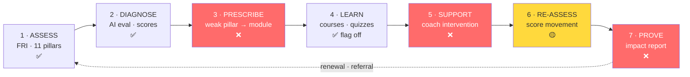
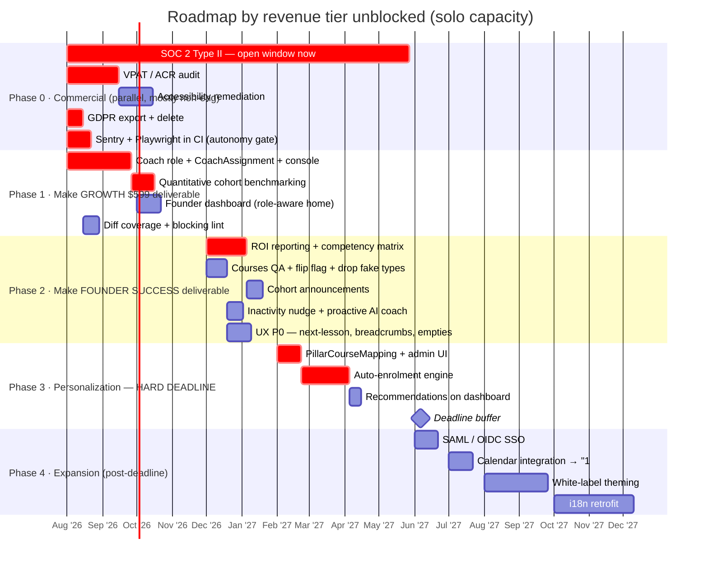
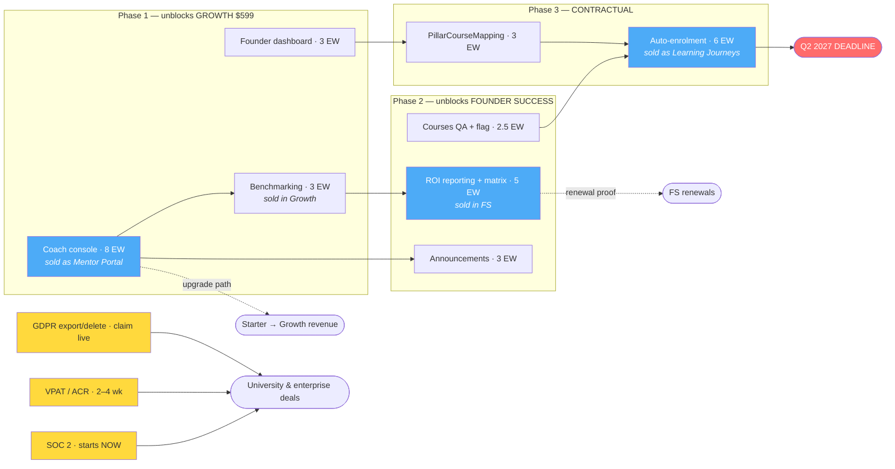

# Bvisionry — Roadmap

Single source of truth. Supersedes `production-roadmap-requirements.md` and
`production-roadmap-board-review.md`.

Last revised: 2026-07-25 · Verified against `main`
Scope: `backend` (Spring Boot 4 / Java 21) + `web` (Next.js 16 / React 19)

**Companions:** `agent-policy.yml` (machine-readable decisions — what agents
load) · `agent-execution-graph.md` (how the work gets executed)

---

- [Part I — Strategy](#part-i--strategy) · what we sell, what's missing, what it costs
- [Part II — Engineering specification](#part-ii--engineering-specification) · the actual work
- [Part III — Delivery](#part-iii--delivery) · phases, risks, decisions

---

# Part I — Strategy

## 1. Verdict

The platform is **much further along than a feature list implies**. The
assessment engine, course catalog and player, certificates, cohorts, multi-tenant
org hierarchy, workshops and notifications are all built and hardened. The
expensive, slow, risky work is done.

Three findings define what to do next.

**1 · We sell a measurement instrument, not an LMS.** The pricing page sells the
**Founder Readiness Index**, priced per *cohort*, in which learning content
appears only in the top tier. That positioning is correct and already chosen —
but the engineering backlog was written as if we were building an LMS. The two
describe different products.

**2 · Six features are sold today and do not exist** (§3). Including the
Growth-tier "Mentor/Organization access portal" — the only unbuilt feature in
the self-serve ladder, and therefore the single thing standing between a $299
customer and a $599 one.

**3 · The plan was oversubscribed 1.7×.** At the observed solo velocity the
original three phases were ~75 engineer-weeks against ~45 available before the
Q2 2027 deadline. Re-ordered around the tier ladder and cut per §12, it fits with
~6 weeks of buffer.

Ordering rule for everything below: **deliver what is already sold, cheapest
tier first, before building anything that is not yet sold.**

---

## 2. What we sell

| Tier | Monthly | Annual eff. | Capacity | Learning content? |
|---|---|---|---|---|
| **Starter** | $299 | $209 | 1 cohort/quarter · 20 founders | ❌ None |
| **Growth** *("most clients start here")* | $599 | $419 | 1 cohort/month · 40 founders | ❌ None |
| **Founder Success** | Contact Sales | — | Unlimited | ✅ Journeys + coaching |

Annual billing discounts ≈30%. Comparison ladder reads `Assessment & Screening →
Development & Learning → Analytics & Reporting`. Four verticals: accelerators,
universities, investors, corporate.

Two consequences:

**Learning is a top-tier add-on.** Two of three tiers ship zero content. The LMS
is delivery machinery for Founder Success contracts.

**The unit of value is a measured cohort.** Score every roadmap item by whether
it lets us sell, upgrade, or renew a cohort.

---

## 3. The delivery gap — sold, not built

| Sold in | Promised | Reality | Cost |
|---|---|---|---|
| **Growth $599** | "Mentor/Organization access portal" | ❌ The coach console. Only unbuilt feature in the self-serve ladder. | 8 EW |
| **Growth $599** | "Cohort benchmarking" | 🟡 `TeamInsightResult.Benchmarking` — AI-narrated *team vs platform* + outlier pillars in the org insight PDF/Excel. Not a quantitative corpus. | 3 EW |
| **Founder Success** | "ROI reporting & analytics" | ❌ The renewal driver for the highest-ACV tier. | 5 EW |
| **Founder Success** | "Personalized learning journeys" | ❌ The Q2 2027 auto-enrolment item. | 10 EW |
| **Founder Success** | "Group + 1:1 coaching sessions" | ❌ No booking model. | 3 EW (integrate) |
| **Founder Success** | "White-label platform option" | 🟡 Data-scoping only; no branding. | 8 EW |
| **Founder Success** | "Custom FRI analysis" | 🟡 Service-delivered today. | — |
| — | Course library | ✅ Built, flag off. **Not sold in Starter or Growth** → blocks no self-serve revenue. | 2.5 EW QA |

### What can be sold safely today

- **Starter** — fully deliverable.
- **Growth** — deliverable *except* the mentor/organization portal. Scope it out
  or commit to a date until Phase 1 ships.
- **Founder Success** — Contact Sales, so stage delivery per contract. Do not
  sign one requiring white-label or native booking before Q3 2027, or
  personalized journeys before Q2 2027.

> Housekeeping: `fri-pricing-plans.tsx` documents an `fri-enterprise` tier in an
> "Enterprise & Add-Ons" section. Neither exists. Also live on the page: Growth
> reads *"Up to 1 cohorts/month."*

---

## 4. Verified current state

Every load-bearing claim re-checked against `main`.

| Claim | Finding | |
|---|---|---|
| `MANAGER` role is dead | 2 refs in 790 files — the enum declaration and one comment. Zero authorities. | ✅ |
| `INSTRUCTOR` is authoring-only | 18 refs, all catalog/quiz authoring | ✅ |
| Courses complete but flagged off | `src/lib/features.ts` — default off; admin authoring deliberately ungated | ✅ |
| Zero i18n | No `next-intl`/`i18n`/`lingui`; no locale on user or org | ✅ |
| Coverage thin | BE 100 test files / 790 source (JaCoCo floor 0.10). **FE 12 / 600 (2%)** | ✅ worse than stated |
| No sitemap/robots/manifest | None; `sw.js` exists | ✅ |
| `Breadcrumb` primitive unused | 4 files | ✅ |
| Exotic lesson types don't render | `SCORM`, `WEBPAGE`, `ARTICLE` in the enum + API contract, **no runtime** | ✅ |
| **Enterprise SSO** | ❌ Google OAuth2 + local credentials only. No SAML/OIDC. | new |
| **Team capacity** | 105 BE + 84 FE commits in 6 months from **one contributor** | new |

Steps 1, 2 and 4 — the expensive ones — are built. The loop breaks at 3, 5 and 7,
which are comparatively cheap. **Three medium pieces convert a feature collection
into a defensible product.**

---

## 5. Market context

Competitors are **program-operations** platforms — AcceleratorApp (500+ programs,
~40% of major US accelerators), F6S, Babele (Google, UN, Bosch), Catalyzer,
Sopact Sense — selling applications, deal flow, mentor matching, demo days. Band
is **$200–800/month per program**, putting Growth at $599 squarely in it. We sell
the diagnostic instead: same buyer, same budget line, different product.

The category's structural weakness is the **"Cohort Cliff"** — no persistent
founder identity connecting intake → activity → outcome in one queryable record,
described as unclosable by adding a feature. **We already have that record.**
Benchmarking and ROI reporting are the features that expose it. Both are sold and
unbuilt (§3). That is the moat.

**Selling the instrument lowers the procurement bar** — SCORM, xAPI and HRIS drop
out of scope entirely. It substitutes a different bar, unbudgeted:

| Requirement | Status | Consequence |
|---|---|---|
| **SOC 2 Type II** | ❌ | Most common late-stage B2B blocker; required by university CIO/CISO vendor-risk programs. **3–12 month observation window, uncompressible.** |
| **VPAT / ACR (WCAG 2.1 AA)** | ❌ | *Virtually impossible to sell to multiple universities without one* in 2026. **2–4 weeks.** |
| **SAML 2.0 / OIDC SSO** | ❌ | Confirmed with IT during procurement. |
| **GDPR export & deletion** | ⚠️ **Claimed publicly, not built** | Pricing FAQ states data is *"encrypted and GDPR-compliant."* Retention jobs exist; export/delete do not. |
| **FRI validity evidence** | ❌ | Instruments are bought on validity. Nothing captures whether a pillar score predicts funding, survival or revenue. |
| ~~SCORM / xAPI / HRIS~~ | N/A | Out of scope under this positioning. |

Where the market is going: adaptive personalization is the defining capability
(~30% lower time-to-competency, 40–50% higher completion); skills taxonomy and
competency mapping is the organising primitive (the 11 pillars *are* a competency
framework, not yet exposed as one); proactive AI agents that intervene are
shipping in CYPHER and Degreed.

---

## 6. Capacity

Engineer-weeks (EW) at observed solo velocity with AI assistance. ~45 productive
EW available in the 11 months to the deadline.

| | Original plan | Re-ordered (§11) |
|---|---|---|
| Phase 1 | 26 EW | 18 EW |
| Phase 2 | 24 EW | 15.5 EW |
| Phase 3 | 25 EW | 10 EW |
| **Total** | **~75 EW → 17 months** | **~43.5 EW → fits, ~6 wk buffer** |

### Estimate corrections

| Item | Original | Actual | Why |
|---|---|---|---|
| White-label | M–L | **L (8 EW)** | Runtime tenant theming across 600 FE files + branded sender + domain routing |
| Auto-enrolment | L | **L (6 EW)** ✓ | Overrun risk is idempotency/override/audit, not the rules engine |
| Coach console | L | **L (8 EW)** ✓ | Correctly sized; correctly identified as the unlock for three other items |
| i18n retrofit | L | **L (10 EW)** ✓ | "Adopt next-intl for new surfaces now" is the correct cheap hedge |
| Courses QA + flag | S | **2.5 EW** | 12 lesson types × desktop/mobile is not small |

**Reject the JaCoCo 10%→40% ratchet.** Chasing a global percentage across 790
files produces tests nobody asked for over code nobody is changing. **Require
coverage on changed lines** (~70% diff coverage) — one CI config change. The
frontend at 2% is the real risk and should get the attention the ratchet would
have consumed.

---

# Part II — Engineering specification

## 7. Gap analysis — item by item

Legend: ✅ built · 🟡 partial · ❌ missing · S (<1 wk) / M (1–3 wk) / L (>3 wk)

| # | Item | | Current state | What's needed | Eff |
|---|---|---|---|---|---|
| 1 | Content upload (video/PDF/slides) | ✅ | MinIO presigned upload (512 MB multipart), dropzone, 12 lesson types | **Remove** `SCORM`/`WEBPAGE`/`ARTICLE` from authoring — enum-only, no runtime | S |
| 2 | Course structure + mindset checkbox | ✅ | `Course → Section → Content`, sequencing, publish states, per-content completion | Boolean reflection flag per completion, or reuse embedded assessments | S |
| 3 | Founder dashboard | 🟡 | Separate hubs behind an `/app` NavCard grid | Unified home: assigned modules, completion %, next-up, pillar snapshot. Data exists — composition page + one aggregate endpoint | M |
| 4 | **Coach view** *(sold as Mentor Portal)* | ❌ | No coach surface. INSTRUCTOR = authoring; MANAGER = nothing | §8: `CoachAssignment`, roster, review queue, console | L |
| 5 | Reflection prompts | ✅ | Quizzes + embedded pillar assessments (`Content.pipelineId`) | Optional lightweight free-text type | S |
| 6 | Completion certificates | ✅ | Entity, PDF, public verification, FE page | None | — |
| 7 | Reminders (untouched N days) | 🟡 | Email + Web Push, per-type prefs, ShedLock jobs | Inactivity rule: no `ContentProgress` on assigned course for N days → nudge | S–M |
| 8 | Cohort completion analytics | 🟡 | Assessment-side only; cohorts + enrollments soft-FK'd | Join enrollment progress across cohort membership → **re-scope as ROI reporting (#16)** | M |
| 9 | Pillar → module linking | 🟡 | Forward link only (lesson embeds assessment) | `PillarCourseMapping` (pillarId → courseIds, score band) + admin UI + "recommended for you" | M |
| 10 | **Automated course selection** ⏰ Q2 2027 | 🟡 | `PipelineAutoAssignment` auto-assigns *assessments*; engine produces pillar scores + thresholds | On `EVALUATED`: read scores, match mappings, create enrollments, notify. Rules engine + idempotency + admin override | L |
| 11 | Self-paced library | ✅ | Fully built — **flagged off** | QA, then flip. Add "optional/explore" labelling | S |
| 12 | Mobile friendly | ✅ | Tailwind responsive, collapsing sidebar, sheet drawer | `manifest.json` (sw.js exists → near-free PWA), device QA on player | S |
| 13 | Multi-language | ❌ | Zero i18n, all copy hardcoded | BE locale + translation tables; FE next-intl across ~600 files. **Defer past deadline; adopt for new surfaces now** | L |
| 14 | Org custom content (white-label) | 🟡 | `orgId`-scoped everything, `parentOrganization` hierarchy, org-admin authoring | Missing the *look*: branding entity (logo, palette, sender), runtime theming, de-hardcode `hello@bvisionry.com` | L |
| 15 | Coaching calendar | ❌ | Nothing. "Coach" today = AI text assistant (SSE) | **Integrate Cal.com** — do not build native | M |
| 16 | **ROI / impact reporting** *(sold, not on original roadmap)* | ❌ | — | Cohort pillar movement over time, per-founder deltas, exportable + brandable for funders. Certificate PDF + export infra already exist | M |
| 17 | **Competency matrix** *(new)* | ❌ | Pillar data exists | Expose 11 pillars as a formal framework: mastery matrix per founder/cohort, movement over time. Presentation layer over existing data | S |
| 18 | **Proactive AI nudges** *(new)* | 🟡 | AI coach is reactive chat | Point existing AI infra at detected inactivity + score drops. Merges with #7 | S |
| 19 | **Cross-tenant benchmarking** *(sold)* | 🟡 | AI-narrated team-vs-platform in insight reports | Quantitative corpus: "your cohort vs 400 pre-seed B2B SaaS founders." Compounds with every customer; uncopyable by a new entrant | M |
| 20 | Cohort communications | ❌ | No human-to-human channel anywhere | §10 — announcements only | M |

---

## 8. RBAC & role restructure

### Current

- Enum: `SUPER_ADMIN, ORG_ADMIN, INSTRUCTOR, MANAGER, MEMBER` (mirrored in FE `src/lib/auth.ts`)
- `@PreAuthorize` on 65 controllers + `@orgAccess.isInOrg(#orgId)`; FE 3-layer defense (edge cookie → server `requireRole()` returning **404 not 403** → backend)
- **`MANAGER` is dead** — declared, assignable, grants nothing. A user given it silently has member access. Security smell.
- **No relationship model linking a coach to founders/cohorts** — so even a wired role couldn't scope its data.
- Persona vs role correctly separated: "Founder" lives in `MemberType`. Keep it that way.

### Target

| Role | Persona | Scope | Key permissions |
|---|---|---|---|
| `SUPER_ADMIN` | Platform team | Platform | Everything; orgs, AI config, platform analytics |
| `ORG_ADMIN` | Program admin | Org + sub-orgs | Members, cohorts, authoring, analytics, reminders, branding |
| `COACH` **(new)** | Coach / facilitator | **Assigned cohorts/founders only** | Read roster, review reflections/submissions, comment, run workshops, own availability |
| `INSTRUCTOR` | Content author | Org | Catalog/quiz CRUD — **kept separate from COACH** (policy §9.1) |
| `MEMBER` | Founder (`MemberType=FOUNDER`) | Self | Own assessments, assigned + self-paced courses, program, bookings |
| ~~`MANAGER`~~ | — | — | **DELETE** — migrate holders → MEMBER (policy §9.2) |

### Required work

**Backend**
1. Migration: introduce `COACH`, remap `MANAGER` → `MEMBER`. Audit `users.role` values first. **Expand-contract: add COACH and migrate holders in one release; remove MANAGER from the enum in a later one.**
2. Entity `CoachAssignment` (coachUserId ↔ cohortId and/or founderUserId, orgId) — the scoping backbone for every coach endpoint.
3. Guard bean `@coachAccess.canViewFounder(#userId)` / `canViewCohort(#cohortId)`, mirroring `OrgAccessGuard`.
4. Coach API: roster (founders + completion %), reflection/submission review queue, per-founder detail (reuse `MemberResultsController` data, coach-scoped).
5. `@PreAuthorize` audit — every `ORG_ADMIN` controller reviewed for whether `COACH` gets read access.

**Frontend**
1. `src/lib/app-nav.ts` coach section; `src/lib/roles.ts` labels.
2. Route area `(app)/app/coach/*`: dashboard (roster + completion), founder detail, review queue.
3. `requireRole()` guards; keep the 404-not-403 convention.

---

## 9. Architecture changes worth making

**Frontend**
1. **Split `src/components/site/`** (43 files) — separate marketing chrome from app-shell; the one folder fighting the otherwise clean feature-folder layout.
2. **Founder dashboard as `/app` home** — replace the NavCard grid for members; keep the grid for admins.
3. **Coach console area** (§8).
4. **Finish or remove `next-themes`** — dark tokens exist, no toggle. Half-wired deps rot. Keep it if white-label is coming and make theming runtime-injectable per tenant.
5. **Route-level `error.tsx` / `loading.tsx`** across `/app` — today most errors fall to `global-error.tsx`.
6. **i18n discipline now, execution later** — adopt next-intl for *new* surfaces (coach console, dashboard) immediately so the retrofit bill stops growing.

**Backend**
1. **Resolve `MANAGER`** (§8).
2. **New `coaching` vertical slice** matching ArchUnit conventions: `CoachAssignment`, coach endpoints, later availability.
3. **`personalization` concern** in the assessment module: `PillarCourseMapping` + auto-enrolment handler on evaluation-complete events (pattern exists in `AutoAssignmentEventHandler`).
4. **Soft-FK integrity job** — catalog/programflow use UUID soft-FKs; scheduled orphan detection (enrollments→deleted courses, `Content.pipelineId`→deleted pipelines) so drift is visible.
5. **Branding entity** (deferred): per-org logo, palette, sender/reply-to. No custom domains (policy §9.5).
6. **i18n data model** (deferred): `locale` on user + org; translation side-tables rather than column explosion.

---

## 10. Cohort communications

No human-to-human channel exists. Closest touchpoints: `ExerciseComment`
(reviewer feedback — the closest thing to threaded discussion),
`WorkshopTeam.helpRequestedAt` (a raised hand), course reviews, one-way
notifications, AI coach chat. The marketing site's WhatsApp button implies
support happens **off-platform**.

**Decision (policy §9.6): announcements only.** Threads and DMs are deferrable
and both carry permanent moderation cost.

- `Announcement`: id, orgId, cohortId, authorUserId, title, body (sanitized), pinned, createdAt
- Fan-out through the existing `UserNotification` + email/push preference system
- Sanitize with the existing OWASP sanitizer; plain-text-plus-links first
- Scoping via a guard bean (same pattern as `@orgAccess`/`@coachAccess`); coaches moderate in assigned cohorts, org admins org-wide
- Report/flag + `AuditLog`; notification preferences must cover the new type
- Delivery: TanStack Query polling. SSE only if needed — the AI coach already streams, so the pattern exists. No WebSockets at this scale.

Deferred: contextual discussion threads, coach↔founder DMs, founder↔founder DMs.

---

## 11. UI/UX & navigation

Goal: every step reachable in ≤2 obvious clicks from a stable anchor, and the
user is always told what to do next.

**Works well today:** consistent `PageHero` across 39 pages + shared
`APP_PAGE_BODY` width, clear sidebar active states, collapsible icon rail, fully
role-gated nav, correct deep-linking from the notification bell, a "continue
where you left off" card, and the program task player's exemplary "Next: {task} →"
flow.

### Friction found

| # | Issue | Where | Impact |
|---|---|---|---|
| 1 | No breadcrumbs in `/app`; org pages run 6 levels deep with one back-hop | `Breadcrumb` used on 2 marketing pages only | Users lost in admin drill-ins |
| 2 | **Course player has no "Next lesson"** — only "Mark as complete", then pick from the sidebar | `learn/_components/content-viewer.tsx` | Breaks the core learning loop; program player does this right |
| 3 | `/app` home is a link grid; spotlight is assessment-only; **admins get zero dynamic content** | `(app)/app/page.tsx` | No "needs attention" queue |
| 4 | SUPER_ADMIN sidebar ≈25 flat items; ORG_ADMIN gets 2 links with everything buried | `src/lib/app-nav.ts` | Wall-of-links for one role, hidden features for the other |
| 5 | No command palette (cmd+k) | — | Cheapest nav accelerator given the tree depth |
| 6 | No onboarding; assessments empty state dead-ends ("Check back soon") | `assessments-list.tsx` | New users land with no guidance |
| 7 | Assessment results have no onward CTA to courses | `results/_components/results-body.tsx` | Misses the core product loop |
| 8 | Notification inbox is dropdown-only, capped at 20, no "See all" | `notification-bell.tsx` | Older notifications unreachable |
| 9 | Post-login lands on `/app` for every role | `(auth)/actions.ts` | Extra hop for admins every session |
| 10 | Duplicated `organizations/[orgId]/*` vs `sub-organizations/[subOrgId]/*` trees; nested tabs not URL-addressable | org console | Two URLs per resource; unshareable state |
| 11 | Orphan route `(app)/app/admin/exercises/page.tsx`, linked from no nav | — | Dead code |
| 12 | Marketing header has no self-serve signup ("Request a free trial" → lead modal) | `site-header.tsx` | Fine if invite-led; blocks self-serve otherwise |

### Requirements

**P0 — core loop & wayfinding**
1. **"Next lesson" in the course player** — replicate the program player's next-CTA; auto-advance option. (S)
2. **Breadcrumbs on all `/app` pages ≥2 levels deep** — primitive exists; layout-level trail. (S–M)
3. **Role-aware home** — members get a real dashboard (spotlight extended to courses + program next-task + recommendations); admins get KPI cards + "needs attention" (idle founders, pending reviews). (M)
4. **No dead-end empty states** — standardize on the shared `EmptyState`; every one names the next action. (S)

**P1 — findability & admin ergonomics**
5. Command palette (cmd+k), role-gated. (M)
6. Group the platform sidebar into collapsible sections; promote Members/Reports to the ORG_ADMIN sidebar. (S–M)
7. Role-based post-login redirect. (S)
8. Full `/app/notifications` page + "See all". (S)
9. Results → recommended module CTA (manual first, auto once #10 lands). (S)

**P2 — structure & polish**
10. First-run onboarding checklist (member: assess → results → first module; coach: review roster). (M)
11. Unify the parallel org/sub-org trees — one URL per resource. (L, alongside coach console)
12. URL-addressable tabs — lift in-page tab state into search params. (S–M)
13. Remove orphan `admin/exercises`. (S)
14. Mobile: keep the Sheet drawer; consider a 4-item bottom tab bar for member surfaces; audit the 16-tab horizontal scroll on the org console. (M)

### Navigation principles (all new surfaces)

- Every page belongs to exactly one sidebar anchor; breadcrumb when deeper.
- Every completed action proposes the next one.
- Admin "needs attention" beats admin "browse everything".
- State a user can see should be linkable.
- One resource, one URL.

---

## 12. Cross-cutting production requirements

### Security
- [ ] Access-token TTL 24h → 15–30 min (refresh rotation works; access tokens are not revocable today)
- [ ] Audit anonymous read endpoints — confirm `LessonContentController` and catalog detail never return non-preview bodies to anonymous users
- [ ] Complete CSP: nonce pipeline for `script-src`/`style-src` (deferred in `next.config.ts`)
- [ ] Keep the `StartupSafetyValidator` pattern; same fail-closed check for every new secret
- [ ] Pen-test the public token flows (`/a/[token]`, surveys, business cards) before scale marketing

### Quality & CI
- [ ] Fix the 13 pre-existing lint errors; make lint **blocking** in FE CI
- [ ] **Diff coverage ~70% on changed lines** (not the global ratchet — see §6)
- [ ] FE component/integration tests for the big `/app` pages (8 unit tests today, all in `src/lib/`)
- [ ] **Playwright e2e in CI** with a compose stack — specs exist, never run. *Prerequisite for autonomous delivery.*
- [ ] Full QA across the 12 lesson types before flipping the courses flag; delete unimplemented ones

### Observability & operations
- [ ] **Error tracking (Sentry) on both ends** — Prometheus/Actuator exists, no exception aggregation. *Prerequisite for autonomous delivery: it is the rollback trigger.*
- [ ] Alerting on ShedLock jobs — a silently dead `EvaluationReaper` or reminder job is invisible today
- [ ] Uptime + synthetic checks on the public token flows
- [ ] Backup/restore drill for Postgres + MinIO; documented RPO/RTO
- [ ] Load-test the anonymous public-assessment path (it is the marketing funnel)

### Compliance & data
- [ ] **GDPR account export + deletion** — the pricing FAQ already claims compliance
- [ ] Retention policy surfaced to users
- [ ] Terms/privacy review for AI evaluation of user content (AI call logging exists — good)
- [ ] SOC 2 Type II observation window opened
- [ ] VPAT / ACR ordered

### SEO / PWA
- [ ] `sitemap.ts`, `robots.txt`, `manifest.json` (sw.js present)

---

# Part III — Delivery

## 13. Phases, ordered by the tier they unblock

| Phase | Unblocks | Effect |
|---|---|---|
| **0 · Commercial** | All tiers | Removes procurement blockers; closes a live GDPR claim |
| **1 · Growth tier** | $599/mo self-serve | Makes the featured tier deliverable; enables Starter→Growth upgrade |
| **2 · Founder Success** | Contact Sales ACV | ROI proof — the renewal driver — plus content delivery |
| **3 · Personalization** | Founder Success | Contractual Q2 2027 obligation |
| **4 · Expansion** | New segments | SSO, booking, white-label, i18n |

### Why this ordering

**Coach console is the first thing built.** Not for architectural reasons — it is
sold as the Growth "Mentor/Organization access portal", it is the only unbuilt
feature in the self-serve ladder, and it is therefore the single feature between
a $299 customer and a $599 one.

**The courses flag drops to Phase 2.** Courses are not sold in Starter or Growth,
so flipping the flag releases no self-serve revenue. It is a Founder Success
delivery dependency.

**Benchmarking is promoted into Phase 1** — a paid Growth feature currently
shipping as an AI-written narrative.

**ROI reporting is the renewal driver**, not mid-priority analytics.

**GDPR export/delete is Phase 0** because the pricing FAQ already claims it.

**Phase 3 starts February with ~6 weeks of buffer.**

### Critical path

Three nodes gate everything: **coach console** (Growth revenue), **ROI reporting**
(FS renewals), **auto-enrolment** (the deadline). Compliance runs on a separate
track unaffected by engineering progress — which is why it starts now.

### Cut list (how the 75 EW became 43.5)

| Cut | Saves |
|---|---|
| Native booking → integrate Cal.com | 7 EW |
| Discussion threads + DMs → announcements only | 5 EW |
| i18n retrofit → deferred (adopt for new surfaces only) | 10 EW |
| Command palette, org tree unification, bottom tab bar | 6 EW |
| Global coverage ratchet → diff coverage | ~3 EW |

### Scope fit

| Path | Scope | Capacity | Q2 2027 | Sold-but-unbuilt remaining |
|---|---|---|---|---|
| **A — Solo (baseline)** | Phases 0–3 | ~43.5 of ~45 EW | ✅ ~6 wk buffer | White-label + native booking (both FS, stageable per contract) |
| **B — Original ordering** | Original 1–3 | ~75 of ~45 EW | ❌ ~6 months late | Growth still undeliverable into 2027 |
| **C — +2 engineers from Q4 26** | 0–3 **plus** SSO, white-label, comms | ~70 EW / 3 people | ✅ | None |

Board framing: Path A is *"we stop selling things we cannot ship, in that order."*
Path C is *"we can also sell the top tier without caveats a year earlier."*

---

## 14. Risks

| # | Risk | Sev | Mitigation |
|---|---|---|---|
| 1 | **Bus factor of one** — one person holds 1,390 source files at 2% FE coverage | 🔴 | Highest-priority hire. Interim: diff coverage, ADRs, runbooks. Not a feature. |
| 2 | **Compliance not started** — SOC 2 is uncompressible | 🔴 | Engage an auditor this quarter; VPAT in parallel (2–4 wk) |
| 3 | **Deadline was oversubscribed 1.7×** | 🔴 | Path A cut list, or fund Path C |
| 4 | **Growth tier sold with an unbuilt feature** | 🟠 | Phase 1 item 1; scope out of contracts until it ships |
| 5 | **FE coverage 2%**, no e2e in CI, non-blocking lint | 🟠 | Diff coverage; wire the existing Playwright specs |
| 6 | **Dead `MANAGER` role** grants nothing while appearing assignable | 🟠 | Remove in the coach-role migration |
| 7 | **No error aggregation** — production failures invisible | 🟠 | Half a day. Also the autonomy rollback trigger. |
| 8 | Category competition well funded (AcceleratorApp ~40% of major US accelerators) | 🟡 | Compete on measurement, not program ops |
| 9 | 24h non-revocable access tokens | 🟡 | Shorten to 15–30 min |
| 10 | i18n debt compounds per page | 🟡 | next-intl for new surfaces now |

---

## 15. Decisions — closed

Machine-readable in `agent-policy.yml`. Agents must not re-litigate these.

| # | Question | Decision |
|---|---|---|
| 1 | `INSTRUCTOR` vs `COACH` | **Two roles.** Authoring and coaching are different jobs with different data scopes. |
| 2 | `MANAGER` | **Delete.** Migrate holders → `MEMBER`. A role granting nothing while looking meaningful is a security defect. |
| 3 | Calendar | **Integrate Cal.com.** Saves 7 EW. Revisit only if a customer pays for native. |
| 4 | i18n scope | **UI chrome only, not before Q3 2027.** Translated *content* multiplies authoring burden for every customer — a business-model change. |
| 5 | White-label depth | **Logo + colours only.** Custom domains and branded email are a long tail of DNS, deliverability and support cost. |
| 6 | Communications | **Announcements only.** Threads/DMs deferrable; both carry permanent moderation cost. |
| 7 | Vertical | **Accelerator-first** — confirmed by the tier ladder and four vertical pages. Enterprise L&D would imply SCORM/xAPI/HRIS; never enter that roadmap by accident. |
| 8 | Fund Path C? | **Yes if capital allows.** Converts a survival year into a market-position year. Path A is achievable regardless, but risk #1 stays unaddressed. |

---

## 16. Next 30 days

1. Engage a SOC 2 auditor; open the observation window.
2. Order the VPAT/ACR audit (2–4 weeks to report).
3. Post the engineering hire (risk #1).
4. **Start the coach console** — the Growth-tier portal we already charge $599/mo for.
5. Ship GDPR export/delete; the pricing FAQ already claims it.
6. Wire Sentry on both ends and Playwright into CI — half a day and a few days respectively, and both are autonomy prerequisites.
7. Give sales the §3 deliverable-today list so no further contract commits white-label, native booking, or personalized journeys ahead of §13.
8. Switch CI to diff coverage; make lint blocking. Remove `WEBPAGE`/`ARTICLE`/`SCORM` from the authoring UI.

---

## Sources

[D2L — Essential LMS Features 2026](https://www.d2l.com/blog/lms-features/) ·
[LMSPedia — Corporate LMS Buyer's Guide](https://lmspedia.org/what-is-corporate-lms/) ·
[Selleo — LMS Integration: Standards, Costs & Compliance](https://selleo.com/blog/lms-integration-explained-standards-costs-compliance) ·
[AcceleratorApp — Best Accelerator Management Software 2026](https://www.acceleratorapp.co/en/blogs/category/all/blog/the-best-accelerator-management-software-in-the-united-states-of-america-2026/) ·
[Sopact — Accelerator Software / the Cohort Cliff](https://www.sopact.com/use-case/accelerator-software) ·
[Catalyzer](https://www.catalyzerapp.com/accelerators) ·
[Babele](https://babele.co/) ·
[CYPHER Learning — AI personalization 2026](https://www.cypherlearning.com/blog/business/top-5-lms-platforms-that-use-ai-to-personalize-learning-in-2026) ·
[Disprz — Adaptive Learning Platforms](https://disprz.ai/blog/adaptive-learning-platform-overview) ·
[360Learning — Top AI-Powered Learning Platforms](https://360learning.com/blog/ai-learning-platforms/) ·
[SOC2Auditors — SOC 2 for Startups](https://soc2auditors.org/insights/soc-2-compliance-for-startups/) ·
[episki — SOC 2 for EdTech](https://episki.com/now/soc2-for-education) ·
[Accessible.org — Universities Requiring VPATs](https://accessible.org/news/colleges-universities-requiring-vpats/) ·
[AudioEye — SaaS Accessibility in Regulated Industries](https://www.audioeye.com/post/saas-accessibility-regulated-industries/) ·
[Accessibility.Works — VPAT/ACR Guide](https://www.accessibility.works/blog/saas-vpat-acr-guide-reporting/)
